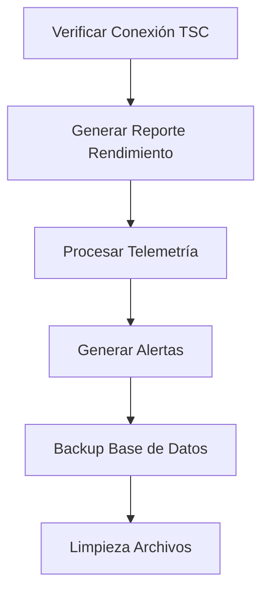
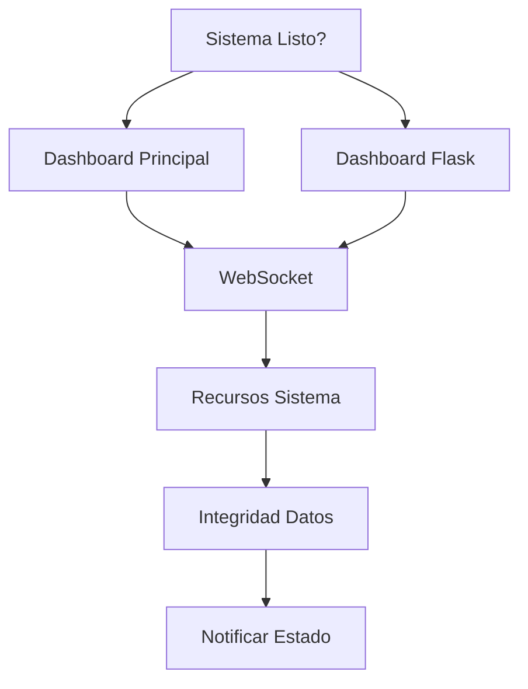

# Apache Airflow Integration - Train Simulator Autopilot

Esta integración añade capacidades de orquestación y automatización avanzadas
al sistema Train Simulator Autopilot utilizando Apache Airflow.

## 🏗️ Arquitectura

```log
Train Simulator Autopilot + Apache Airflow
├── airflow/
│   ├── dags/                 # Workflows automatizados
│   │   ├── train_simulator_reports_dag.py
│   │   ├── train_simulator_monitoring_dag.py
│   │   └── train_simulator_maintenance_dag.py
│   ├── plugins/              # Plugins personalizados
│   │   └── train_simulator_plugin.py
│   ├── logs/                 # Logs de ejecución
│   ├── config/               # Configuración adicional
│   └── airflow.cfg          # Configuración de Airflow
├── docker-compose.airflow.yml
├── Dockerfile.airflow
├── init_airflow.sh
└── README.md
```

## 🚀 Inicio Rápido

### 1. Inicializar Airflow

```bash
# Hacer ejecutable el script de inicialización
chmod +x init_airflow.sh

# Ejecutar inicialización
./init_airflow.sh
```

### 2. Acceder a la interfaz web

- **Airflow UI**: <http://localhost:8080>
- **Usuario**: admin
- **Contraseña**: admin
- **Flower (Celery Monitoring)**: <http://localhost:5555>

## 📋 DAGs Disponibles

### 1. `train_simulator_reports_dag`

**Frecuencia**: Cada 4 horas
**Propósito**: Generación automática de reportes del sistema

Tareas:

- ✅ Verificación de conexión TSC
- 📊 Generación de reporte de rendimiento
- 📈 Procesamiento de telemetría
- 🚨 Generación de alertas del sistema
- 💾 Backup de base de datos
- 🧹 Limpieza de archivos antiguos

### 2. `train_simulator_monitoring_dag`

**Frecuencia**: Cada 15 minutos
**Propósito**: Monitoreo continuo de la salud del sistema

Tareas:

- 🌐 Verificación de dashboards (Principal y Flask)
- 🔌 Verificación de conexiones WebSocket
- 📊 Monitoreo de recursos del sistema (CPU, memoria, disco)
- 🔒 Verificación de integridad de datos
- 📢 Envío de notificaciones de estado

### 3. `train_simulator_maintenance_dag`

**Frecuencia**: Diariamente a las 2:00 AM
**Propósito**: Mantenimiento y backup del sistema

Tareas:

- 💾 Creación de backup completo del sistema
- 🗑️ Limpieza de backups antiguos (30+ días)
- 🔧 Optimización de bases de datos
- 💽 Verificación de espacio en disco
- 📊 Actualización de estadísticas del sistema

## 🔧 Plugins Personalizados

### `TrainSimulatorPlugin`

#### Operadores

**`TrainSimulatorHealthOperator`**

```python
health_check = TrainSimulatorHealthOperator(
    task_id='system_health_check',
    check_dashboard_main=True,
    check_dashboard_flask=True,
    check_tsc_connection=True,
    check_database=True,
    check_websocket=True,
    timeout=30
)
```

**`PerformanceAlertOperator`**

```python
performance_alert = PerformanceAlertOperator(
    task_id='performance_monitoring',
    cpu_threshold=80.0,
    memory_threshold=85.0,
    response_time_threshold=2.0
)
```

#### Sensores

**`TelemetryDataSensor`**

```python
wait_for_telemetry = TelemetryDataSensor(
    task_id='wait_telemetry_data',
    telemetry_dir='/opt/airflow/train_simulator/data/telemetry',
    min_records=100,
    max_wait_time=3600
)
```

## 📊 Monitoreo y Alertas

### Métricas Monitoreadas

- **Sistema**: CPU, memoria, disco
- **Aplicación**: Tiempos de respuesta, estado de servicios
- **Datos**: Integridad, tamaño, backups
- **Conectividad**: TSC, WebSocket, dashboards

### Notificaciones

El sistema puede integrarse con:

- Slack
- Discord
- Email
- PagerDuty
- Webhooks personalizados

## 🔄 Flujos de Trabajo

### Ejemplo: Pipeline de Reportes



### Ejemplo: Monitoreo Continuo



## 🛠️ Desarrollo y Testing

### Ejecutar DAGs Manualmente

```bash
# Desde el contenedor de Airflow
docker-compose -f docker-compose.airflow.yml exec airflow-webserver \
    airflow dags unpause train_simulator_reports_dag

docker-compose -f docker-compose.airflow.yml exec airflow-webserver \
    airflow dags trigger train_simulator_reports_dag
```

### Ver Logs

```bash
# Logs de Airflow
docker-compose -f docker-compose.airflow.yml logs -f airflow-scheduler

# Logs específicos de un DAG
docker-compose -f docker-compose.airflow.yml exec airflow-webserver \
    airflow dags show train_simulator_reports_dag
```

### Testing Local

```bash
# Ejecutar tests de DAGs
python -m pytest airflow/dags/ -v

# Validar sintaxis de DAGs
python -c "from airflow.models import DagBag; d = DagBag(); print(f'DAGs encontrados: {list(d.dags.keys())}')"
```

## 📁 Estructura de Archivos Generados

```log
/opt/airflow/
├── reports/              # Reportes generados automáticamente
│   ├── performance_report_*.json
│   ├── telemetry_analysis_*.json
│   └── system_alerts_*.json
├── backups/              # Backups del sistema
│   └── train_simulator_backup_*.tar.gz
├── monitoring/           # Métricas de monitoreo
│   └── system_metrics_*.json
├── alerts/               # Alertas generadas
│   └── performance_alerts_*.json
├── health_checks/        # Resultados de health checks
│   └── health_check_*.json
└── maintenance/          # Información de mantenimiento
    └── system_stats.json
```

## 🔧 Configuración Avanzada

### Variables de Entorno

```bash
# En airflow/.env
AIRFLOW__CORE__EXECUTOR=CeleryExecutor
AIRFLOW__CORE__MAX_ACTIVE_RUNS_PER_DAG=1
AIRFLOW__SCHEDULER__CATCHUP_BY_DEFAULT=False
TRAIN_SIMULATOR_PATH=/opt/airflow/train_simulator
```

### Conexiones

El sistema utiliza las siguientes conexiones de Airflow:

- `postgres_default`: Base de datos PostgreSQL
- `redis_default`: Broker Redis para Celery

### Pools

- `default_pool`: Pool por defecto
- `maintenance_pool`: Pool para tareas de mantenimiento (limitado)

## 🚨 Solución de Problemas

### Problemas Comunes

1. **DAGs no aparecen en la UI**

   ```bash
   docker-compose -f docker-compose.airflow.yml restart airflow-webserver
   ```

2. **Errores de conexión a PostgreSQL**

   ```bash
   docker-compose -f docker-compose.airflow.yml logs postgres
   ```

3. **Tareas quedan en estado "queued"**

   ```bash
   docker-compose -f docker-compose.airflow.yml restart airflow-worker
   ```

### Logs de Debugging

```bash
# Ver logs de scheduler
docker-compose -f docker-compose.airflow.yml logs airflow-scheduler

# Ver logs de webserver
docker-compose -f docker-compose.airflow.yml logs airflow-webserver

# Ver logs de worker
docker-compose -f docker-compose.airflow.yml logs airflow-worker
```

## 📈 Escalabilidad

### Configuración para Producción

1. **Base de datos externa**: Usar PostgreSQL/RDS en lugar de contenedor local
2. **Redis cluster**: Para alta disponibilidad
3. **Load balancer**: Para múltiples instancias de webserver
4. **Workers adicionales**: Escalar horizontalmente los workers de Celery

### Monitoreo Avanzado

- **Prometheus + Grafana**: Métricas detalladas
- **ELK Stack**: Centralización de logs
- **Alert Manager**: Gestión avanzada de alertas

## 🤝 Contribución

Para añadir nuevos DAGs o modificar existentes:

1. Crear el DAG en `airflow/dags/`
2. Añadir documentación en este README
3. Probar localmente antes de commit
4. Actualizar diagramas de flujo si es necesario

## 📄 Licencia

Este proyecto mantiene la misma licencia que Train Simulator Autopilot.
