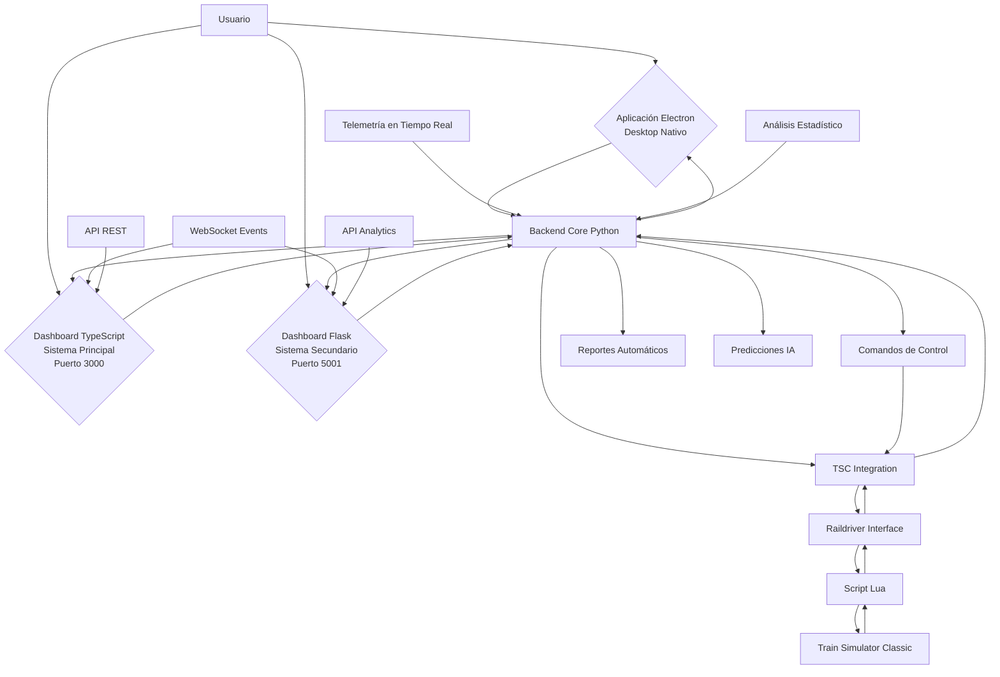
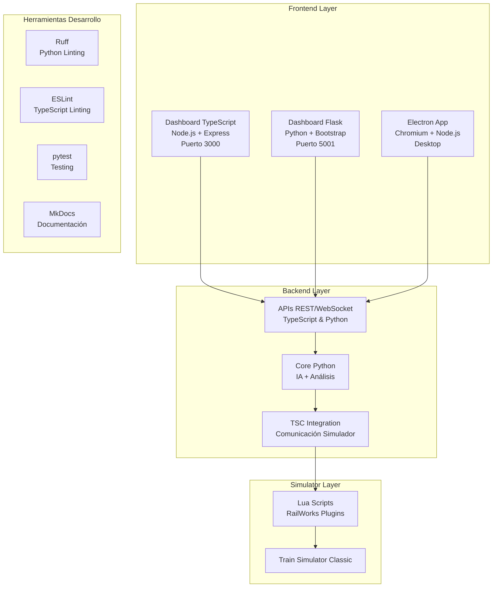

# 🏗️ Arquitectura del Proyecto: Train Simulator Autopilot

## 📋 Descripción General

Este proyecto integra una IA de conducción automática para Train Simulator
Classic, conectando módulos en Python, Lua, JavaScript, TypeScript y
herramientas de visualización modernas. La arquitectura implementa **tres
dashboards especializados** para diferentes casos de uso, con un sistema
modular, escalable y orientado a la integración con hardware
RailDriver/joystick.

### Última Actualización

2 de diciembre de 2025

## 🏛️ Componentes Principales

### 🤖 Backend Core (Python)

- **Lógica de decisión**: Análisis de telemetría, generación de comandos de
conducción
- **Procesamiento en paralelo**: multiprocessing/threading para rendimiento
óptimo
- **Pruebas automáticas**: Framework completo con pytest y cobertura
- **Análisis predictivo**: Machine learning para optimización de conducción
- **🔥 NUEVO**: Análisis de métricas del motor (RPM, corriente, tracción,
deslizamiento)
- **📊 NUEVO**: APIs de análisis estadístico avanzado

### 🔗 Integración con Simulador

- **Comunicación bidireccional**: Lectura/escritura de telemetría y comandos
- **Protocolo Raildriver**: Interfaz nativa con Train Simulator Classic
- **Script Lua**: `Railworks_GetData_Script.lua` para extracción de datos
- **Multi-locomotora**: Soporte para formaciones complejas
- **📊 NUEVO**: 4 métricas adicionales del motor desde RailWorks plugins

### 🌐 Dashboards Multi-Plataforma

#### 🏠 **Dashboard TypeScript (Sistema Principal)**

- **Tecnología**: Node.js + TypeScript + Express.js + Socket.IO
- **Puerto**: 3000
- **Características**: API REST completa, WebSocket en tiempo real, interfaz
moderna
- **Estado**: ✅ **Completamente operativo**

#### 📊 **Dashboard Flask (Sistema Secundario)**

- **Tecnología**: Python Flask + Bootstrap + Socket.IO
- **Puerto**: 5001
- **Características**: Dashboard web responsive, métricas avanzadas, análisis
estadístico
- **Estado**: ✅ **Completamente operativo**

#### 🖥️ **Aplicación Electron (Sistema Nativo)**

- **Tecnología**: Electron + Chromium
- **Características**: Aplicación de escritorio nativa, verificación automática
de servicios
- **Estado**: ✅ **Completamente operativa**

### 🛡️ Sistema de Seguridad

- **Validación múltiple**: Verificación de comandos y estados
- **Detección de anomalías**: Monitoreo continuo de condiciones peligrosas
- **Respuesta de emergencia**: Acciones automáticas en situaciones críticas
- **Auditoría completa**: Logging estructurado de todos los eventos

## 🔄 Flujo de Datos Arquitectural (2025)



### 📊 Diagrama de Componentes por Tecnología



## 📊 Diagramas de Arquitectura

### 🎯 Diagrama General Multi-Dashboard (2025)

**Archivos**: `architecture_diagram.py`, `architecture_diagram_complete.py`

- **Vista de alto nivel** de los tres dashboards operativos
- **Flujo de datos** entre componentes modernos
- **Conexiones API** y WebSocket documentadas
- **Integración tecnológica** Python + Node.js + TypeScript

### 📈 Diagrama Completo del Proyecto

**Archivo**: `architecture_diagram_complete.png` (actualizado 2025)

- **Vista detallada** de todos los archivos y componentes
- **Estructura completa** del proyecto con tres dashboards
- **Dependencias entre módulos** y archivos
- **APIs documentadas** en `api-reference.md`

### 🛠️ Generación de Diagramas

Los diagramas se generan automáticamente usando la librería `diagrams` de
Python:

```bash
# Instalar dependencias
pip install diagrams
winget install Graphviz.Graphviz

# Generar diagramas actualizados
python architecture_diagram.py
```

### 🔄 Diagramas de Flujo Específicos

- **Flujo de IA**: `flujo-ia-conduccion.md`
- **APIs WebSocket**: Documentadas en `api-reference.md`
- **Integración Multi-locomotora**: `multi_locomotive_integration.py`

## 📁 Estructura de Archivos (2025)

```text
TrainSimulatorAutopilot/
├── 📱 Aplicación Desktop
│   ├── main.js (Electron - app principal)
│   ├── preload.js (Seguridad Electron)
│   └── assets/ (Iconos, recursos)
├── 🌐 Dashboard TypeScript (Sistema Principal)
│   ├── src/
│   │   ├── server.ts (Express.js + Socket.IO)
│   │   ├── routes/ (APIs REST)
│   │   ├── websocket/ (Eventos en tiempo real)
│   │   └── public/ (Frontend React/Vue)
│   ├── package.json
│   ├── tsconfig.json
│   └── dist/ (Build output)
├── 🌐 Dashboard Flask (Sistema Secundario)
│   ├── web_dashboard.py (Flask + Socket.IO)
│   ├── templates/ (HTML con Bootstrap)
│   ├── static/
│   │   ├── js/dashboard.js
│   │   └── css/dashboard.css
│   └── bokeh_apps/ (Visualizaciones)
├── 🐍 Backend Core Python
│   ├── tsc_integration.py (Core TSC)
│   ├── autopilot_system.py (IA conducción)
│   ├── predictive_telemetry_analysis.py (ML)
│   ├── alert_system.py (Alertas)
│   ├── automated_reports.py (Reportes)
│   └── multi_locomotive_integration.py
├── 📊 APIs de Análisis Estadístico
│   ├── analytics/ (Módulos Seaborn/Scipy)
│   ├── reports/ (Generación automática)
│   └── statistical_models/ (Modelos ML)
├── 🔧 Scripts y Configuración
│   ├── start.bat / start_dev.bat
│   ├── config.ini (Configuración Python)
│   ├── pytest.ini (Testing)
│   └── .github/workflows/ (CI/CD)
├── 🧪 Testing & Calidad
│   ├── tests/
│   │   ├── unit/ (Tests Python)
│   │   ├── integration/ (Tests APIs)
│   │   └── e2e/ (Tests end-to-end)
│   └── htmlcov/ (Cobertura)
├── 📚 Documentación
│   ├── docs/
│   │   ├── api-reference.md (APIs completas)
│   │   ├── ARCHITECTURE.md (Este archivo)
│   │   └── *.md (Documentación específica)
│   ├── README.md
│   ├── CHANGELOG.md
│   └── mkdocs.yml
└── 📊 Datos y Resultados
    ├── telemetry_data/ (*.json)
    ├── reports/ (PDFs automáticos)
    ├── models/ (Modelos ML entrenados)
    └── logs/ (Auditoría completa)
```

## 🔧 Tecnologías Utilizadas (2025)

### Backend & APIs

- **Python 3.9+**: Core del sistema, IA, análisis predictivo
- **Node.js 18+**: Dashboard TypeScript, APIs modernas
- **TypeScript**: Type safety, desarrollo escalable
- **Flask + Socket.IO**: Dashboard secundario, APIs REST/WebSocket

### Frontend & Interfaces

- **Express.js**: Framework web para dashboard principal
- **Bootstrap**: UI responsive para dashboard Flask
- **Electron**: Aplicación desktop nativa

### Simulador & Hardware

- **Lua**: Scripts de integración con RailWorks
- **RailDriver API**: Interfaz hardware nativa
- **Multi-locomotora**: Soporte para formaciones complejas

### Desarrollo & Calidad

- **Ruff**: Linting y formateo Python ultrarrápido
- **ESLint**: Linting TypeScript/JavaScript
- **pytest + coverage**: Testing completo con métricas
- **GitHub Actions**: CI/CD automatizado
- **MkDocs + markdownlint**: Documentación estructurada

### Visualización & Análisis

- **Seaborn + Matplotlib**: Gráficos estadísticos
- **Bokeh**: Visualización web interactiva
- **Pandas + NumPy**: Procesamiento de datos
- **Scikit-learn**: Machine learning básico

## 🚀 Escalabilidad y Rendimiento

- **Arquitectura modular**: Componentes independientes y reutilizables
- **Procesamiento paralelo**: Optimización para múltiples núcleos
- **Cache inteligente**: Almacenamiento temporal de datos frecuentes
- **Monitoreo continuo**: Métricas de rendimiento en tiempo real
- **Actualizaciones OTA**: Sistema de actualización automática

## 🔒 Consideraciones de Seguridad

- **Validación de entrada**: Todos los datos externos son validados
- **Control de acceso**: Autenticación para operaciones críticas
- **Registro de auditoría**: Trazabilidad completa de acciones
- **Respaldo automático**: Copias de seguridad de configuraciones críticas
- **Monitoreo de integridad**: Verificación continua de componentes

---

_Este documento describe la arquitectura moderna del Train Simulator Autopilot
v3.0.0 (diciembre 2025), con tres dashboards operativos y APIs completamente
documentadas. La arquitectura facilita la integración, mantenimiento y evolución
futura del sistema._
