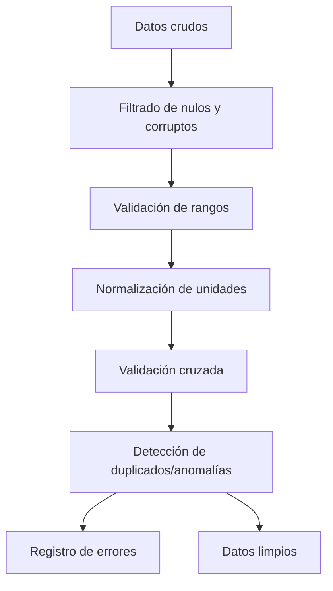

# Limpieza y Validación de Datos de Telemetría

## Reglas de limpieza y validación de datos

## 1. Dependencias técnicas

- Python >= 3.9
- pandas >= 1.3
- Recomendado: pytest para pruebas automáticas

## 2. Seguridad y protección de datos

- Validar y sanitizar datos antes de procesarlos
- Controlar accesos a archivos de datos y logs

## 3. Filtrado de registros

## Implementación recomendada: Python (pandas)

Para el filtrado de registros en este proyecto, se utilizará la librería pandas
de Python, que permite procesar y limpiar grandes volúmenes de datos de forma
eficiente y flexible. A continuación se muestra un ejemplo básico de cómo
aplicar las reglas de filtrado descritas:

```python
import pandas as pd

# Cargar datos de telemetría
df = pd.read_csv('telemetry_data.csv')

# Filtrar valores nulos en variables críticas
df = df.dropna(subset=['CurrentSpeed', 'DistanceTravelled'])

# Validar rangos físicos
df = df[(df['CurrentSpeed'] >= 0) & (df['CurrentSpeed'] <= 200)]  # km/h
df = df[(df['AirBrakePipePressurePSI'] >= 0) & (df['AirBrakePipePressurePSI'] <= 150)]

# Guardar datos limpios
df.to_csv('telemetry_clean.csv', index=False)
```

- Descartar registros con valores nulos en variables críticas (velocidad,
distancia)
- Validar rangos físicos de velocidad (0-200 km/h) y presión (0-150 PSI)
- Eliminar registros con formato de fecha/hora inválido

## 4. Normalización de datos

- Convertir velocidad a km/h (fórmula: mph × 1.60934)
- Normalizar posición en metros y presión en PSI
- Unificar formatos de fecha/hora (ISO 8601)

## 5. Validación cruzada

- Verificar coherencia entre variables (ej: velocidad = 0 → posición constante)
- Comparar con límites físicos del sistema

## 6. Detección de duplicados y anomalías

- Eliminar registros duplicados (misma marca de tiempo)
- Detectar cambios bruscos en posición o velocidad

## 7. Registro de errores

```python
# Guardar registros con errores
errores = df[df['CurrentSpeed'].isna()]
errores.to_csv('errores_telemetria.csv', index=False)
```

## 8. Automatización de pruebas

```python
def test_velocidad_valida():
    datos = pd.DataFrame({"CurrentSpeed": [-10, 50, 300]})
    resultado = limpiar_datos(datos)
    assert all((resultado["CurrentSpeed"] >= 0) & (resultado["CurrentSpeed"] <= 200))
```

## 9. Referencias

- Buenas prácticas de limpieza de datos en Python/pandas
- Validación de datos en sistemas de simulación

## 10. Mejora continua

- Actualizar reglas según nuevos requisitos del sistema
- Documentar cambios en el workflow-log

## 11. Diagrama de flujo de limpieza


