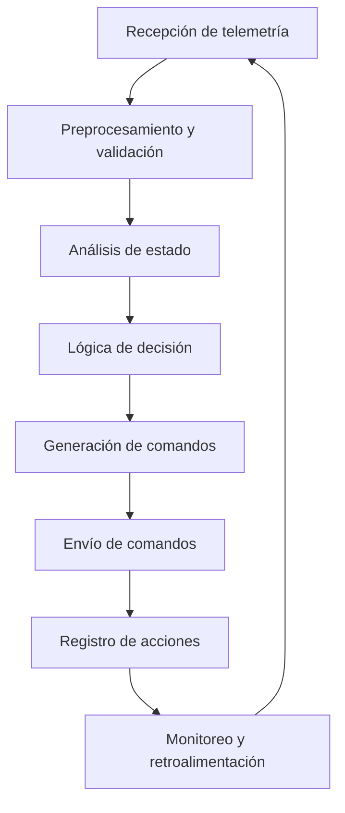

# Flujo de IA para conducción autónoma - Train Simulator Classic

## Estado de implementación: ✅ PARCIALMENTE COMPLETADO

**Optimizaciones Python implementadas:**

- ✅ `scripts/performance_test.py` - Medición y benchmarking de rendimiento
- ✅ `scripts/analisis_rendimiento.py` - Análisis detallado con métricas
completas
- ✅ `scripts/sincronizacion_telemetria.py` - Optimización dinámica de
frecuencia
- ✅ `scripts/ia_logic.py` - Clase `IAConduccionOptimizada` con
ThreadPoolExecutor

**Documentación:**

- ✅ Recomendaciones completas para integración Rust/C++
- ✅ Arquitecturas y patrones de alto rendimiento
- ✅ Casos de uso y justificaciones técnicas

## Resumen de implementación

- **Recepción de datos:** Socket TCP/IP + modo simulado
- **Preprocesamiento:** Validación, normalización, filtrado
- **Análisis de estado:** Contextual con etiquetas de eventos
- **Lógica de decisión:** Algoritmos jerárquicos con prioridades
- **Generación de comandos:** Mapeo flexible a controles físicos
- **Envío:** Protocolo JSON con confirmación
- **Registro:** Logging estructurado con JSON
- **Monitoreo:** Retroalimentación en tiempo real
- **Optimización:** Procesamiento paralelo y ajuste dinámico de frecuencia

---

## Integración con C++/C#/Node.js para comunicación en tiempo real

La integración con módulos externos en C++/C#/Node.js permite la comunicación
directa y eficiente entre la IA y el simulador, facilitando el envío de
comandos, la recepción de telemetría y la interoperabilidad con hardware
especializado.

## Arquitectura recomendada

- Utilizar sockets TCP/UDP para comunicación en tiempo real.
- Alternativamente, emplear APIs REST o WebSocket para integración
multiplataforma.
- Definir un formato de mensajes estándar (JSON, binario, Protobuf) para
garantizar compatibilidad y escalabilidad.

### Ejemplo de flujo de integración

1. La IA (Python) genera un comando de control.
2. El módulo externo (C++/C#/Node.js) recibe el comando por socket o API.
3. El módulo traduce y envía el comando al simulador o hardware.
4. El módulo puede devolver una confirmación o respuesta a la IA.

### Ejemplo de código: envío de comando por socket

**Python (cliente):**

```python
import socket

def enviar_comando(comando):
    with socket.socket(socket.AF_INET, socket.SOCK_STREAM) as s:
        s.connect(('localhost', 5000))
        s.sendall(comando.encode())
        respuesta = s.recv(1024)
        print('Respuesta:', respuesta.decode())

enviar_comando('SET_THROTTLE 1')
```

**Node.js (servidor):**

```javascript
const net = require('net');
const server = net.createServer((socket) => {
  socket.on('data', (data) => {
    console.log('Comando recibido:', data.toString());
    socket.write('OK');
  });
});
server.listen(5000, () => console.log('Servidor listo en puerto 5000'));
```

**C++ (servidor básico):**

```cpp
#include <iostream>
#include <winsock2.h>

int main() {
    WSADATA wsa;
    SOCKET s, new_socket;
    struct sockaddr_in server, client;
    char buffer[1024];
    WSAStartup(MAKEWORD(2,2), &wsa);
    s = socket(AF_INET, SOCK_STREAM, 0);
    server.sin_family = AF_INET;
    server.sin_addr.s_addr = INADDR_ANY;
    server.sin_port = htons(5000);
    bind(s, (struct sockaddr *)&server, sizeof(server));
    listen(s, 3);
    int c = sizeof(struct sockaddr_in);
    new_socket = accept(s, (struct sockaddr *)&client, &c);
    int read_size = recv(new_socket, buffer, 1024, 0);
    buffer[read_size] = '\0';
    std::cout << "Comando recibido: " << buffer << std::endl;
    send(new_socket, "OK", 2, 0);
    closesocket(s);
    WSACleanup();
    return 0;
}
```

### Formato de mensajes recomendado

- Usar JSON para comandos simples:

  ```json
  { "accion": "SET_THROTTLE", "valor": 1 }
  ```

- Para alto rendimiento, considerar Protobuf o binario.

### Recomendaciones prácticas

- Documentar todos los endpoints, formatos y respuestas esperadas.
- Implementar manejo de errores y confirmaciones.
- Probar la integración con scripts automáticos y casos límite.
- Mantener la documentación actualizada en este archivo y en la hoja de trabajo.

---

## Estrategias adicionales de optimización del flujo hacia la IA

## 1. Dependencias técnicas y recomendaciones de entorno

- Python >= 3.9, pandas >= 1.3, matplotlib >= 3.5, plotly >= 5.0
- Recomendado: pytest para pruebas automáticas, logging para registro de errores
- Hardware: RailDriver/joystick compatible

## 2. Recomendaciones de lenguajes y tecnologías para cada etapa

Para el desarrollo del flujo de la IA en Train Simulator Classic, se recomienda:

- **Python + pandas:** Para la limpieza, filtrado, normalización, validación y
análisis de datos. Es eficiente, flexible y facilita la integración con IA y
machine learning.
- **Python (multiprocessing, threading):** Para procesamiento en paralelo y
tareas que requieran dividir el trabajo entre hilos o procesos.
- **C++/C#/Node.js:** Para módulos de comunicación en tiempo real con el
simulador (sockets, APIs), o cuando se requiera máxima velocidad y
compatibilidad.
- **Rust/C++:** Para tareas críticas de alto rendimiento, como procesamiento
masivo o cálculos complejos en tiempo real.
  - **Ejemplo de uso:**
    - _Rust_: Implementar módulos de procesamiento intensivo, como análisis de
grandes volúmenes de datos o cálculos matemáticos complejos, donde la velocidad
y la seguridad son prioritarias.
    - _C++_: Crear extensiones nativas para el simulador, optimizar algoritmos
de control, o manejar grandes buffers de datos en tiempo real.
  - **Cuándo usarlo:**
    - Cuando el procesamiento requiere máxima eficiencia y bajo consumo de
recursos.
    - Si se necesita integración directa con librerías nativas o hardware
específico.
    - Para tareas que no pueden tolerar retrasos, como cálculos de física,
simulación de señales, o procesamiento de telemetría en tiempo real.
- **JavaScript/Node.js/Electron:** Para interfaces gráficas avanzadas o paneles
de control web.
  - **Ejemplo de uso:**
    - _JavaScript/Electron_: Crear una aplicación de escritorio con paneles de
control interactivos para visualizar el estado del tren y controlar la IA.
    - _Node.js_: Desarrollar un servidor web que reciba datos de la IA y los
muestre en tiempo real en dashboards accesibles desde cualquier dispositivo.
    - _JavaScript puro_: Implementar visualizaciones dinámicas en navegadores,
como gráficos de telemetría o alertas en tiempo real.
  - **Cuándo usarlo:**
    - Cuando se requiere una interfaz gráfica avanzada, multiplataforma y fácil
de usar.
    - Si necesitas paneles de monitoreo, dashboards o controles remotos
accesibles vía web o escritorio.
    - Para integrar visualización y control en tiempo real con la IA y el
simulador.
- **Python (matplotlib, plotly):** Para visualización y monitoreo de datos.
  - **Ejemplo de uso:**
    - _matplotlib_: Generar gráficos de líneas, barras o dispersión para
analizar la evolución de variables como velocidad, presión o eficiencia
energética.
    - _plotly_: Crear dashboards interactivos y visualizaciones dinámicas para
monitorear el estado del tren y la IA en tiempo real.
  - **Cuándo usarlo:**
    - Cuando necesitas analizar tendencias, comparar variables o detectar
anomalías en los datos.
    - Si requieres visualización rápida y flexible durante el desarrollo y
pruebas.
    - Para crear reportes, dashboards o herramientas de monitoreo que ayuden a
ajustar y validar el comportamiento de la IA.

Se recomienda usar Python y pandas como base principal, y complementar con otros
lenguajes solo en módulos donde el rendimiento, la integración o la
visualización lo requieran. Analiza cada etapa y decide si conviene migrar o
combinar tecnologías según los requisitos del sistema y los recursos
disponibles.

## 3. Estrategias de optimización y buenas prácticas

- Procesamiento en paralelo: Divide tareas entre hilos o procesos independientes
(por ejemplo, lectura de datos y lógica de decisión) para aprovechar mejor los
recursos del sistema.
- Uso de memoria en vez de disco: Mantén los datos en memoria RAM el mayor
tiempo posible para evitar accesos lentos a disco y acelerar el procesamiento.
- Formatos binarios o compactos: Utiliza formatos como JSON compacto, binario o
buffers en vez de texto plano para la telemetría, reduciendo el tamaño y el
tiempo de lectura/escritura.
- Eventos y triggers: Implementa lógica basada en eventos, de modo que la IA
solo procese datos cuando ocurren cambios relevantes, en vez de ciclos
constantes.
- Caching inteligente: Guarda resultados de cálculos frecuentes o costosos para
reutilizarlos y evitar repetir operaciones innecesarias.
- Monitorización y profiling: Usa herramientas para medir el tiempo de cada
etapa y detectar cuellos de botella, permitiendo ajustes precisos.
- Ajuste dinámico de frecuencia: Si el sistema detecta sobrecarga, reduce
temporalmente la frecuencia de actualización para mantener la estabilidad.

## 4. Diagrama de flujo visual del proceso de la IA



## 5. Flujo de la IA para conducción automática

A continuación se documenta cada paso del proceso, desde la recepción de datos
hasta la puesta en marcha total de la IA en Train Simulator Classic.

### Recomendaciones prácticas adicionales

- **Simulación y pruebas en entorno controlado:** Antes de desplegar la IA en
escenarios reales, crea entornos de simulación con datos históricos y casos
límite para validar el comportamiento. Usa scripts de test que simulen fallos de
sensores, cambios bruscos de variables y situaciones de emergencia.
- **Gestión de configuración dinámica:** Implementa archivos de configuración
(YAML, JSON) para ajustar parámetros de la IA sin modificar el código. Permite
cambiar umbrales, frecuencias y reglas de decisión en caliente.
- **Registro detallado y visualización de logs:** Añade niveles de log (info,
warning, error, debug) y visualiza los logs en dashboards para facilitar el
análisis. Integra alertas automáticas para eventos críticos o desviaciones
inesperadas.
- **Análisis post-mortem y aprendizaje automático:** Almacena los datos de cada
sesión para análisis posterior y entrenamiento de modelos de machine learning.
Usa los logs para identificar patrones de fallo y mejorar la lógica de decisión.
- **Documentación de interfaces y protocolos:** Especifica claramente los
formatos de datos, comandos y respuestas entre la IA y el simulador. Documenta
cómo se gestionan los errores y las excepciones en la comunicación.
- **Manejo de versiones y despliegue seguro:** Usa control de versiones (Git) y
despliegue automatizado para evitar errores humanos. Mantén siempre una versión
estable y documenta los cambios en cada release.

#### Ejemplo de archivo de configuración YAML

```yaml
ia:
  velocidad_maxima: 120
  umbral_freno: 80
  frecuencia_ciclo_ms: 100
  modo_simulacion: true
  alertas:
  activar: true
  nivel: warning
```

#### Ejemplo de test de simulación en Python

```python
import pytest

def test_fallo_sensor():
  datos = {'velocidad': None, 'freno': 0}
  assert datos['velocidad'] is not None, 'Fallo de sensor: velocidad no disponible'

def test_cambio_brusco():
  velocidad_antes = 80
  velocidad_despues = 140
  assert abs(velocidad_despues - velocidad_antes) < 50, 'Cambio brusco de velocidad detectado'
```

---

## 1. Recepción de datos de telemetría

- La IA lee los datos desde archivos de telemetría, sockets o APIs
proporcionados por el simulador.
- Archivos típicos utilizados:
- `GetData.txt` (plugins de RailWorks)
- `data-received-from-railworks.md` (documentación y logs)
- `train_log.txt`, `telemetria.txt` (logs personalizados generados por scripts
LUA o Python)
- Ejemplo de variables recibidas: velocidad, posición, acelerador, freno,
señales próximas, presión de aire, nivel de combustible (NO USADO), estado de
luces, etc.

### Recomendaciones específicas para la recepción de datos

- **Validación temprana de datos:** Implementa validaciones inmediatas al
recibir cada registro (tipos, rangos, formato). Rechaza o marca como sospechosos
los datos fuera de rango antes de procesarlos.
- **Buffer de entrada y redundancia:** Usa un buffer circular para almacenar los
últimos N registros y evitar pérdida de datos por picos de tráfico. Si es
posible, recibe datos desde múltiples fuentes y compara para detectar
inconsistencias.
- **Timestamp y sincronización:** Añade un timestamp preciso a cada registro
recibido y sincroniza los datos con el reloj del sistema o simulador.
- **Gestión de errores y reconexión automática:** Si la fuente de datos falla,
implementa reintentos automáticos y alertas. Documenta los errores y tiempos de
reconexión en los logs.
- **Formato extensible y versionado:** Define un formato de datos flexible (por
ejemplo, JSON con versión) e incluye un campo de versión en cada registro para
facilitar la evolución y compatibilidad futura.

#### Ejemplo de validación en Python

```python
def validar_telemetria(registro):
  if not isinstance(registro['velocidad'], (int, float)):
    return False
  if registro['velocidad'] < 0 or registro['velocidad'] > 350:
    return False
  if 'timestamp' not in registro:
    return False
  return True
```

## 2. Preprocesamiento y validación de datos

- Filtrado de registros incompletos o corruptos.
- Normalización de unidades (por ejemplo, velocidad en km/h, presión en PSI).
- Validación de rangos y formatos (descartar valores imposibles).
- Ejemplo: Si la velocidad < 0 o > 350 km/h, descartar registro.

### Recomendaciones avanzadas para el preprocesamiento

- **Pipeline modular de limpieza:** Divide el preprocesamiento en etapas
independientes: filtrado, normalización, validación, enriquecimiento. Usa
funciones o clases para cada etapa y permite activar/desactivar módulos según el
tipo de datos.
- **Automatización de reglas y umbrales:** Define las reglas de validación y
normalización en archivos de configuración (YAML/JSON) para facilitar ajustes
sin modificar el código. Permite cambiar umbrales y formatos en caliente.
- **Registro de datos descartados:** Guarda los registros que no pasan la
validación en un archivo de log o base de datos para análisis posterior.
Documenta el motivo del descarte (por ejemplo, “velocidad fuera de rango”,
“formato de fecha inválido”).
- **Enriquecimiento de datos:** Calcula variables derivadas (aceleración,
distancia entre eventos, etc.) durante el preprocesamiento. Añade etiquetas o
flags para facilitar el análisis posterior (por ejemplo, “evento crítico”,
“anomalía detectada”).
- **Validación cruzada y redundancia:** Si tienes datos de varias fuentes,
compara y valida la coherencia entre ellas. Implementa alertas si se detectan
inconsistencias.

#### Ejemplo de pipeline modular en Python

```python
def filtrar_registros(registros):
  return [r for r in registros if r['velocidad'] is not None]

def normalizar_unidades(registro):
  registro['velocidad'] = registro['velocidad'] * 1.60934  # mph a km/h
  return registro

def validar_registro(registro):
  return 0 <= registro['velocidad'] <= 350

def preprocesar(registros):
  filtrados = filtrar_registros(registros)
  normalizados = [normalizar_unidades(r) for r in filtrados]
  validados = [r for r in normalizados if validar_registro(r)]
  return validados
```

## 3. Análisis de estado actual del tren

- Determinación de la situación actual: velocidad, posición, controles activos,
entorno (pendiente, clima, señales).
- Ejemplo de variables analizadas: velocidad actual, aceleración, posición,
estado de frenos, límite de velocidad, distancia a próxima señal.

### Recomendaciones avanzadas para el análisis de estado

- **Análisis contextual y predictivo:** Analiza tendencias (aceleración, cambios
de clima, proximidad de señales) e implementa modelos simples de predicción para
anticipar eventos críticos.
- **Etiquetado de eventos y estados:** Añade etiquetas a cada registro (por
ejemplo, “zona de frenado”, “evento crítico”, “condición normal”) para facilitar
la toma de decisiones y el monitoreo.
- **Visualización y alertas en tiempo real:** Integra dashboards que muestren el
estado actual y las tendencias relevantes. Configura alertas automáticas para
estados peligrosos o fuera de rango.
- **Comparación con reglas y límites dinámicos:** Compara el estado actual con
límites que pueden cambiar según el contexto (por ejemplo, límite de velocidad
variable, condiciones meteorológicas). Permite que la IA ajuste sus parámetros
de análisis según el entorno.

#### Ejemplo de análisis contextual en Python

```python
def etiquetar_estado(registro):
  if registro['velocidad'] > registro['limite_velocidad']:
    registro['evento'] = 'exceso_velocidad'
  elif registro['distancia_senal'] < 200:
    registro['evento'] = 'aproximacion_senal'
  else:
    registro['evento'] = 'normal'
  return registro
```

## 4. Lógica de decisión de la IA

- Aplicación de reglas, algoritmos o modelos (PID, fuzzy logic, machine
learning, reglas basadas en eventos).
- Ejemplo: Si la velocidad supera el límite, iniciar frenada; si la distancia a
la señal de parada es menor a un umbral, aplicar freno de servicio.
- Consideración de seguridad, eficiencia y confort.

### Recomendaciones avanzadas para la lógica de decisión

- **Jerarquía de reglas y prioridades:** Organiza las reglas en niveles de
prioridad (seguridad, eficiencia, confort) y resuelve conflictos dando
preferencia a la seguridad.
- **Decisión basada en contexto:** Ajusta las reglas y algoritmos según el
estado actual, el entorno y las tendencias detectadas (por ejemplo, clima
adverso, proximidad de señales).
- **Modelos híbridos:** Combina reglas simples con algoritmos avanzados (PID,
fuzzy logic, machine learning) para mejorar la adaptabilidad y robustez.
- **Simulación de escenarios y validación:** Antes de ejecutar una decisión,
simula el resultado y valida que no se generen estados peligrosos o
inconsistentes.
- **Registro y auditoría de decisiones:** Documenta cada decisión tomada, el
motivo y el contexto para facilitar la trazabilidad y el análisis post-mortem.

#### Ejemplo de lógica de decisión jerárquica en Python

```python
def decidir_accion(registro):
  # Prioridad 1: Seguridad
  if registro['evento'] == 'exceso_velocidad':
    return 'frenar'
  if registro['evento'] == 'aproximacion_senal' and registro['velocidad'] > 40:
    return 'frenar_suavemente'
  # Prioridad 2: Eficiencia
  if registro['velocidad'] < registro['limite_velocidad'] - 10:
    return 'acelerar'
  # Prioridad 3: Confort
  if registro['aceleracion'] > 2:
    return 'reducir_aceleracion'
  return 'mantener'
```

## 5. Generación de comandos de control

- Traducción de la decisión en comandos concretos para el simulador (acelerar,
frenar, cambiar reversa, activar bocina, luces, etc.).
- Ejemplo: Escribir 'acelerar' en comando.txt, activar freno dinámico, cambiar
posición de reversa.

### Recomendaciones avanzadas para la generación de comandos

- **Abstracción y mapeo flexible:** Usa una capa de abstracción para mapear las
acciones de la IA a comandos específicos del simulador, permitiendo adaptar el
sistema a diferentes locomotoras o versiones.
- **Validación y simulación previa:** Antes de enviar un comando, valida que sea
coherente con el estado actual y simula el resultado para evitar errores o
estados peligrosos.
- **Batching y priorización de comandos:** Agrupa comandos que puedan ejecutarse
juntos y prioriza los más críticos (por ejemplo, freno de emergencia sobre
bocina).
- **Registro y auditoría de comandos:** Documenta cada comando enviado, el
contexto y el resultado para facilitar el análisis y la depuración.
- **Gestión de errores y reintentos:** Si un comando falla, implementa
reintentos automáticos y alertas.

#### Ejemplo de generación y validación de comandos en Python

```python
def generar_comando(accion, estado):
  comandos = {
    'acelerar': 'SET_THROTTLE 1',
    'frenar': 'SET_BRAKE 1',
    'frenar_suavemente': 'SET_BRAKE 0.5',
    'reducir_aceleracion': 'SET_THROTTLE 0.5',
    'mantener': 'SET_THROTTLE 0'
  }
  # Validación previa
  if accion == 'frenar' and estado['velocidad'] < 5:
    return None  # No tiene sentido frenar si ya está casi detenido
  return comandos.get(accion, None)
```

## 6. Envío de comandos al simulador

- Escritura de comandos en archivos, envío por sockets o uso de APIs según la
integración disponible.
- Confirmación de recepción y ejecución por parte del simulador.

### Recomendaciones avanzadas para el envío de comandos

- **Integración multiplataforma:** Implementa métodos para enviar comandos por
diferentes vías (archivos, sockets TCP/UDP, APIs REST/WebSocket) según la
arquitectura y el simulador.
- **Buffer y control de flujo:** Usa un buffer de comandos para evitar saturar
el simulador y controlar el ritmo de envío, especialmente en escenarios de alta
frecuencia.
- **Confirmación y verificación:** Espera confirmación de recepción y ejecución
del comando; si no se recibe, reintenta o alerta al sistema.
- **Gestión de errores y logging:** Registra cada intento de envío, errores y
respuestas del simulador para facilitar la depuración y el análisis.
- **Seguridad y autenticación:** Si usas APIs o sockets, implementa
autenticación y cifrado para proteger la comunicación.

#### Ejemplo de envío de comandos por socket en Python

```python
import socket

def enviar_comando_socket(comando, host, puerto):
  try:
    with socket.socket(socket.AF_INET, socket.SOCK_STREAM) as s:
      s.connect((host, puerto))
      s.sendall(comando.encode())
      respuesta = s.recv(1024)
      return respuesta.decode()
  except Exception as e:
    # Registrar error y reintentar si es necesario
    print(f"Error al enviar comando: {e}")
    return None
```

## 7. Registro de acciones y eventos en logs

### Recomendaciones avanzadas para el registro de logs

- **Logging estructurado y niveles personalizados:** Utiliza el módulo `logging`
de Python con formatos estructurados (JSON, CSV) y define niveles personalizados
(info, warning, error, acción, auditoría) para facilitar el filtrado y análisis
posterior.
- **Auditoría y trazabilidad completa:** Registra no solo las acciones, sino
también el contexto (variables relevantes, estado previo y posterior,
usuario/módulo que ejecuta la acción). Esto permite reconstruir el flujo de
decisiones y detectar anomalías o errores sistemáticos.
- **Rotación y compresión de logs:** Implementa rotación automática de archivos
de log (por tamaño o fecha) y compresión para evitar saturar el disco y
facilitar el archivado.
- **Visualización y análisis post-mortem:** Integra herramientas como ELK Stack
(Elasticsearch, Logstash, Kibana), Grafana o incluso pandas para analizar los
logs, buscar patrones de fallo y optimizar la lógica de la IA.
- **Alertas automáticas y notificaciones:** Configura alertas automáticas
(email, Telegram, Discord, panel visual) para eventos críticos detectados en los
logs, como errores recurrentes, fallos de comunicación o acciones inesperadas.
- **Integración con dashboards y sistemas externos:** Permite que los logs se
envíen a sistemas externos para monitoreo centralizado, análisis avanzado o
integración con sistemas de ticketing/incidencias.
- **Protección y privacidad:** Si los logs contienen datos sensibles, implementa
cifrado y control de acceso. Anonimiza información personal antes de compartir o
analizar externamente.
- **Logs de simulación y pruebas:** Separa los logs de producción y los de
pruebas/simulación para facilitar el análisis y evitar confusiones.

#### Ejemplo avanzado de configuración de logging en Python

```python
import logging
import json
from logging.handlers import RotatingFileHandler

class JsonFormatter(logging.Formatter):
  def format(self, record):
    log_record = {
      'timestamp': self.formatTime(record),
      'level': record.levelname,
      'module': record.module,
      'action': getattr(record, 'action', None),
      'message': record.getMessage(),
      'context': getattr(record, 'context', {})
    }
    return json.dumps(log_record)

logger = logging.getLogger('IA')
logger.setLevel(logging.INFO)
handler = RotatingFileHandler('logs/ia.log', maxBytes=5*1024*1024, backupCount=5)
handler.setFormatter(JsonFormatter())
logger.addHandler(handler)

# Ejemplo de registro de acción
def registrar_accion(action, context):
  extra = {'action': action, 'context': context}
  logger.info(f'Acción ejecutada: {action}', extra=extra)

# Uso
registrar_accion('acelerar', {'velocidad': 28, 'posicion': 'km 12.3', 'freno': 0})
```

#### Ejemplo de análisis post-mortem con pandas

```python
import pandas as pd
import json

def cargar_logs_json(path):
  with open(path) as f:
    lines = f.readlines()
  registros = [json.loads(line) for line in lines]
  return pd.DataFrame(registros)

df_logs = cargar_logs_json('logs/ia.log')
print(df_logs.groupby('action').size())  # Frecuencia de cada acción
print(df_logs[df_logs['level'] == 'ERROR'])  # Filtrar errores
```

#### Ejemplo de alerta automática por Telegram (opcional)

```python
import requests

def enviar_alerta_telegram(mensaje, token, chat_id):
  url = f'https://api.telegram.org/bot{token}/sendMessage'
  data = {'chat_id': chat_id, 'text': mensaje}
  requests.post(url, data=data)

# Uso en el logger
def alerta_critica(mensaje):
  enviar_alerta_telegram(mensaje, 'TOKEN', 'CHAT_ID')
```

---

- Documentación de cada acción tomada, variables relevantes y resultado.
- Ejemplo de línea de log: '2025-12-02 15:32:10 | IA: acelerar | velocidad: 28 |
posición: km 12.3 | freno: 0%'
- Registro de incidencias, errores y eventos especiales.

## 8. Monitoreo y retroalimentación

- Supervisión continua del resultado de las acciones tomadas.
- Ajuste de la lógica de decisión si se detectan desviaciones, errores o
situaciones especiales.
- Ejemplo: Si tras aplicar freno la velocidad no disminuye, activar freno de
emergencia.
- Ciclo de retroalimentación para mejorar el comportamiento de la IA en tiempo
real.

### Recomendaciones para el monitoreo y retroalimentación

1. **Dashboard interactivo (plotly/Dash/Streamlit):**
   - Visualiza en tiempo real variables clave del tren y la IA.
   - Permite detectar anomalías y analizar el comportamiento histórico.
   - Ejemplo básico con plotly:

     ```python
     import plotly.graph_objs as go
     import pandas as pd

     df = pd.read_csv('data/clean/telemetria.csv')
     fig = go.Figure()
     fig.add_trace(go.Scatter(x=df['timestamp'], y=df['velocidad'], mode='lines', name='Velocidad'))
     fig.add_trace(go.Scatter(x=df['timestamp'], y=df['freno'], mode='lines', name='Freno'))
     fig.show()
     ```

   - Para dashboards web en tiempo real, puedes usar Dash o Streamlit.

2. **Sistema de alertas y logging:**
   - Usa el módulo `logging` de Python para registrar eventos, errores y
acciones importantes.
   - Configura alertas automáticas (sonido, email, notificación en la interfaz)
para eventos críticos.
   - Ejemplo de alerta en Python:

     ```python
     import logging

     def verificar_estado(velocidad, limite):
         if velocidad > limite:
             logging.warning(f'¡Alerta! Velocidad excedida: {velocidad} mph')
             # Aquí puedes agregar código para enviar una notificación o activar una alerta visual
     ```

   - Facilita la auditoría y el análisis post-mortem.
   - Paneles visuales (Electron/Node.js) permiten interacción manual y
visualización avanzada.

---

## Recomendaciones para minimizar lag y retraso en la IA

- Utiliza archivos de telemetría pequeños, bien estructurados y con solo los
datos necesarios.
- Realiza validaciones y normalizaciones simples, evitando cálculos innecesarios
en cada ciclo.
- Mantén la lógica de decisión eficiente: prioriza reglas claras y algoritmos
ligeros para la mayoría de casos; reserva modelos complejos solo para
situaciones críticas.
- Usa buffers o colas para la comunicación entre la IA y el simulador, evitando
bloqueos por lectura/escritura en disco.
- Ejecuta el ciclo de la IA en intervalos cortos y definidos (por ejemplo, cada
100 ms), ajustando el tiempo según la capacidad del sistema.
- Si usas sockets o APIs, verifica la velocidad y sincronización para evitar
cuellos de botella.
- Optimiza el registro de logs: guarda solo la información relevante y utiliza
escritura asíncrona si es posible.
- Monitorea el rendimiento del sistema y ajusta los parámetros de frecuencia y
tamaño de los archivos según los resultados.

Implementando estas prácticas, el sistema de IA podrá tomar decisiones en tiempo
real y minimizar el riesgo de lag o retraso en la simulación.

Este flujo puede ser ampliado o adaptado según las necesidades del sistema y la
evolución del proyecto. Se recomienda revisar y documentar cada paso conforme se
implementen nuevas funciones o se detecten oportunidades de mejora.

## Troubleshooting: escenarios de fallo y respuesta

### Recomendaciones avanzadas para troubleshooting y diagnóstico

- **Diagnóstico automatizado:** Implementa scripts que verifiquen el estado de
cada módulo (lectura de telemetría, lógica de decisión, envío de comandos) y
generen reportes automáticos ante fallos.
- **Registro detallado de errores:** Documenta cada error con contexto
(variables, estado previo y posterior, timestamp, módulo afectado) y guarda los
reportes en logs estructurados para análisis posterior.
- **Alertas y notificaciones inmediatas:** Configura alertas automáticas
(sonido, email, Telegram, Discord) para errores críticos o repetidos,
permitiendo intervención rápida.
- **Recuperación automática y fallback:** Implementa mecanismos de retry,
reinicio de módulos y fallback a configuraciones seguras ante fallos
recurrentes. Documenta los pasos de recuperación y registra cada intento.
- **Monitoreo en tiempo real:** Usa dashboards para visualizar el estado de la
IA, frecuencia de errores y métricas clave. Integra paneles con Grafana, Kibana
o Streamlit para análisis visual.
- **Pruebas de estrés y simulación de fallos:** Realiza pruebas periódicas
simulando escenarios de fallo (desconexión de hardware, corrupción de datos,
sobrecarga de comandos) para validar la robustez del sistema.
- **Documentación de incidencias y soluciones:** Mantén un historial de
incidencias, soluciones aplicadas y recomendaciones en un archivo dedicado (por
ejemplo, `workflow-log.md`). Esto facilita la mejora continua y la transferencia
de conocimiento.
- **Integración con sistemas de ticketing:** Si el sistema crece, conecta los
reportes de error con plataformas de gestión de incidencias (Jira, GitHub
Issues, Redmine) para seguimiento y resolución colaborativa.

#### Ejemplo de script de diagnóstico en Python

```python
import logging
import socket

def diagnostico_ia():
  resultados = {}
  # Verificar lectura de telemetría
  try:
    with open('data/raw/telemetria.txt') as f:
      datos = f.read()
    resultados['telemetria'] = 'OK' if datos else 'VACIO'
  except Exception as e:
    resultados['telemetria'] = f'ERROR: {e}'
  # Verificar conexión con simulador
  try:
    s = socket.socket(socket.AF_INET, socket.SOCK_STREAM)
    s.settimeout(2)
    s.connect(('localhost', 12345))
    s.close()
    resultados['simulador'] = 'OK'
  except Exception as e:
    resultados['simulador'] = f'ERROR: {e}'
  # Verificar logs
  try:
    with open('logs/ia.log') as f:
      lines = f.readlines()
    resultados['logs'] = f'{len(lines)} entradas'
  except Exception as e:
    resultados['logs'] = f'ERROR: {e}'
  logging.info(f'Diagnóstico IA: {resultados}')
  return resultados

# Uso
diagnostico_ia()
```

#### Ejemplo de recuperación automática ante fallo

```python
import time

def recuperar_modulo(funcion, max_reintentos=3):
  for intento in range(max_reintentos):
    try:
      return funcion()
    except Exception as e:
      print(f'Intento {intento+1} fallido: {e}')
      time.sleep(2)
  print('Recuperación automática fallida, requiere intervención manual.')
  return None

# Uso
# recuperar_modulo(lambda: conectar_simulador())
```

#### Ejemplo de alerta automática por email (opcional)

```python
import smtplib
from email.mime.text import MIMEText

def enviar_alerta_email(mensaje, destinatario, remitente, password):
  msg = MIMEText(mensaje)
  msg['Subject'] = 'Alerta IA Train Simulator'
  msg['From'] = remitente
  msg['To'] = destinatario
  with smtplib.SMTP_SSL('smtp.gmail.com', 465) as server:
    server.login(remitente, password)
    server.sendmail(remitente, destinatario, msg.as_string())

# Uso
# enviar_alerta_email('Fallo crítico en módulo de comandos', 'destino@email.com', 'origen@email.com', 'password')
```

---

- Si la IA no responde, revisa la frecuencia de lectura y la lógica de decisión.
- Si los comandos no se ejecutan, verifica la configuración de mapeos y permisos
de escritura.
- Si se detectan incidencias recurrentes, analiza los logs y ajusta la lógica.
- Para problemas de integración con hardware, revisa drivers y conexiones.

## Recomendaciones de seguridad y protección de datos

- Protege los archivos de telemetría y logs que contengan información sensible.
- Limita el acceso a configuraciones críticas y realiza backups automáticos.
- Anonimiza datos personales y técnicos antes de compartir o analizar
externamente.

## Integración con módulos externos

> **Avance:** La sección de integración con módulos externos ya incluye
> recomendaciones avanzadas, ejemplos de código y buenas prácticas para
> comunicación en tiempo real (sockets, APIs REST, WebSocket) entre Python y
> Node.js. Falta implementar y documentar el módulo real en C++, C# o Node.js
> para la comunicación directa con el simulador.

### Recomendaciones avanzadas para integración con módulos externos

- **Diseño de interfaces desacopladas:** Utiliza APIs REST, WebSocket, gRPC o
sockets TCP/UDP para comunicar la IA con módulos en otros lenguajes. Define
contratos claros (OpenAPI/Swagger para REST, Protobuf para gRPC) y documenta
cada endpoint, mensaje y respuesta.
- **Formato de datos estándar y versionado:** Usa JSON, Protobuf, XML o binario
según el caso. Incluye campos de versión y metadatos para facilitar la evolución
y compatibilidad.
- **Gestión de errores y timeouts:** Implementa manejo robusto de errores,
reintentos y timeouts en la comunicación. Documenta los códigos de error y las
respuestas esperadas ante fallos.
- **Seguridad y autenticación:** Si la integración es remota, añade
autenticación (tokens, OAuth, claves API) y cifrado (TLS/SSL) para proteger los
datos y evitar accesos no autorizados.
- **Pruebas automáticas de integración:** Desarrolla scripts de test que simulen
la comunicación entre módulos, validen el formato de los mensajes y verifiquen
la respuesta ante escenarios de fallo.
- **Monitorización y logging cruzado:** Registra cada intercambio de datos entre
módulos, incluyendo timestamps, payloads y resultados. Sincroniza los logs para
facilitar el análisis de incidencias.
- **Documentación técnica y ejemplos:** Mantén documentación actualizada de los
protocolos, formatos y ejemplos de uso en cada lenguaje. Incluye diagramas de
flujo y secuencia para visualizar la interacción.
- **Compatibilidad multiplataforma:** Valida la integración en diferentes
sistemas operativos y versiones de los lenguajes involucrados. Usa contenedores
(Docker) para facilitar pruebas y despliegue.

#### Ejemplo de comunicación por socket entre Python y Node.js

**Python (cliente):**

```python
import socket

def enviar_comando(comando):
    with socket.socket(socket.AF_INET, socket.SOCK_STREAM) as s:
        s.connect(('localhost', 5000))
        s.sendall(comando.encode())
        respuesta = s.recv(1024)
        print('Respuesta:', respuesta.decode())

enviar_comando('SET_THROTTLE 1')
```

**Node.js (servidor):**

```javascript
const net = require('net');
const server = net.createServer((socket) => {
  socket.on('data', (data) => {
    console.log('Comando recibido:', data.toString());
    socket.write('OK');
  });
});
server.listen(5000, () => console.log('Servidor listo en puerto 5000'));
```

#### Ejemplo de definición de API REST con OpenAPI (YAML)

```yaml
openapi: 3.0.0
info:
  title: API Control Locomotora
  version: 1.0.0
paths:
  /comando:
    post:
      summary: Enviar comando al simulador
      requestBody:
        required: true
        content:
          application/json:
            schema:
              type: object
              properties:
                accion:
                  type: string
                parametros:
                  type: object
      responses:
        '200':
          description: Comando ejecutado correctamente
        '400':
          description: Error en el formato del comando
```

#### Ejemplo de test de integración en Python

```python
import requests

def test_api_comando():
    url = 'http://localhost:8000/comando'
    payload = {'accion': 'frenar', 'parametros': {'nivel': 1}}
    r = requests.post(url, json=payload)
    assert r.status_code == 200
    assert r.json().get('resultado') == 'OK'

test_api_comando()
```

---
