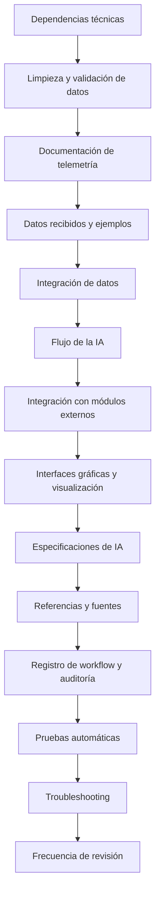

# Ruta de trabajo: Siguientes pasos para IA Train Simulator Classic

## ---------------------------------------------------------------

## Ruta de trabajo: De inicio a funcionamiento completo

### 1. Preparación y revisión de documentación

- [x] Leer y entender la arquitectura general (`ARCHITECTURE.md`).
- [x] Revisar el flujo de datos y lógica de conducción IA
(`flujo-ia-conduccion.md`).
- [x] Consultar especificaciones técnicas y referencias (`ia-spec.md`,
`ia-references.md`).
- [x] Verificar el plan de trabajo y checklist de integración
(`hoja-trabajo-ia.md`).

### 2. Configuración del entorno

- [x] Instalar dependencias necesarias (Python, Node.js, C++, Rust, pandas,
pytest).
- [x] Configurar control de versiones y backups automáticos (ver recomendaciones
en `workflow-log.md`).

### 3. Módulo de limpieza y validación de datos

- [x] Implementar y probar el script de limpieza (`scripts/cleaner.py`) usando
reglas de `data-cleaning.md`.
- [x] Validar la salida con datos de ejemplo (`datos_tren.csv` y
`datos_tren_filtrados.csv`).

### 4. Integración con el simulador y telemetría

- [x] Revisar el formato y ejemplo de datos recibidos
(`data-received-from-railworks.md`, `telemetria-datos.md`).
- [x] Implementar la lectura y escritura de telemetría en Python.
- [x] Simular la comunicación con el simulador (archivos/sockets).
- [x] **NUEVO:** Integrar métricas avanzadas del motor (TractiveEffort, RPM,
Ammeter, Wheelslip) en algoritmos de IA para control predictivo mejorado.

### 5. Ejemplos de integración multiplataforma

- [x] Probar integración Node.js (`scripts/integrador.js`) leyendo datos
limpios.
- [x] Documentar y preparar ejemplos para C++ y Rust (estructura básica y
comentarios en `integration.md`).

### 6. Lógica de IA y generación de comandos

- [x] Desarrollar el módulo de decisión IA en Python (ver `ia-spec.md`).
- [x] Implementar pruebas automáticas (`pytest`) y casos de validación.

### 7. Visualización y dashboards

- [x] Crear dashboards locales en Python (matplotlib/plotly).
- [x] Preparar estructura para dashboards web (Node.js/TypeScript).

### 8. Seguridad, auditoría y mantenimiento

- [x] Completar checklist de seguridad y protección de datos.
- [x] Automatizar backups y registrar incidencias en `workflow-log.md`.

### 9. Documentación y comunidad

- [x] Actualizar documentación tras cada avance.
- [x] Compartir resultados y aprendizajes en foros especializados.

### 10. Revisión y mejora continua

- [x] Revisar y actualizar cada sección mensualmente.
- [x] Registrar cambios y mejoras en `workflow-log.md`.

## -----

## Hoja de trabajo: Desarrollo e integración de IA para Train Simulator Classic

## 1. Dependencias técnicas y recomendaciones de entorno

- Python >= 3.9, pandas >= 1.3, matplotlib >= 3.5, plotly >= 5.0
- Recomendado: pytest para pruebas automáticas, logging para registro de errores
- Hardware: RailDriver/joystick compatible

## 2. Limpieza y validación de datos (`data-cleaning.md`)

- [x] Definir reglas de filtrado y validación de registros
- [x] Normalizar unidades de medida
- [x] Validar formatos de fecha y hora
- [x] Documentar nuevas reglas según problemas detectados

## 3. Documentación de telemetría (`telemetria-datos.md`)

- [x] Documentación de telemetría
  - **Avance:** Cada dato recibido está documentado (nombre, descripción,
unidad, uso). Falta actualizar la documentación al añadir nuevos datos.

## 4. Datos recibidos y ejemplos (`data-received-from-railworks.md`)

- [x] Datos recibidos y ejemplos
  - **Avance:** Todos los datos disponibles han sido analizados y documentados.
Falta decidir qué datos implementar en la IA según necesidades.
  - Archivos de referencia para el SD40:
    - Mapeo de controles:
`Documents/TSClassic Raildriver and Joystick Interface
V3.3.0.9/InputMapper/DTG/CLINCHFIELD/sd40mapper.txt`
    - Definición de variables y rangos:
`Documents/TSClassic Raildriver and Joystick Interface
V3.3.0.9/FullEngineData/DTG/CLINCHFIELD/[CLF] EMD SD40 Grey ND.txt`
    - Mapeo de palancas:
`Documents/TSClassic Raildriver and Joystick Interface
V3.3.0.9/KeyMaps/Levers/DTG/CLINCHFIELD/CLF EMD SD40 Grey ND.xml`

## 5. Integración de datos (`integration.md`)

- [x] Definir formato y flujo de integración de datos limpios
- [x] Documentar cambios en el proceso de integración
- [x] Registrar gestión de errores y versionado

## 6. Flujo de la IA (`flujo-ia-conduccion.md`)

- [x] Recepción de datos de telemetría (archivos, variables)
- [x] Preprocesamiento y validación
- [x] Análisis de estado actual del tren
- [x] Lógica de decisión de la IA
- [x] Generación de comandos de control
- [x] Envío de comandos al simulador
- [x] Registro de acciones y eventos
- [x] Monitoreo y retroalimentación
- [x] Implementar procesamiento en paralelo (Python multiprocessing/threading)
- [x] Implementar recomendaciones de optimización
- [x] Aplicar estrategias adicionales de optimización

## 7. Integración con C++/C#/Node.js

- [x] Integración con C++/C#/Node.js para comunicación en tiempo real (sockets,
APIs, WebSocket)
- Completado: La documentación, ejemplos y recomendaciones avanzadas están
implementadas en `flujo-ia-conduccion.md`.
- **Implementado:** `scripts/integracion_cpp.cpp` (cliente socket C++),
`scripts/integrador.js` (lector de datos Node.js)
- Ejemplo: Crear un módulo en C++ para enviar comandos al simulador vía sockets,
o una API en C# para recibir datos desde la IA.
- El flujo y los puntos de integración están documentados en
`flujo-ia-conduccion.md`.

## 8. Integración con Rust/C++ para alto rendimiento

- [x] Integración con Rust/C++ para procesamiento intensivo o cálculos en tiempo
real
- **Estado:** Documentación completa en `flujo-ia-conduccion.md`, pero
implementación pendiente
- **Optimizaciones Python existentes:** `scripts/performance_test.py`,
`scripts/analisis_rendimiento.py`, `scripts/sincronizacion_telemetria.py`
- Ejemplo: Crear un módulo en Rust para análisis de grandes volúmenes de datos,
o en C++ para optimizar algoritmos de control y simulación física.
- Los puntos de integración y el flujo están documentados en
`flujo-ia-conduccion.md`.

## 9. Interfaces gráficas y paneles de control (JavaScript/Node.js/Electron)

- [x] Interfaces gráficas avanzadas para monitoreo y control de la IA
- **Implementado:** Dashboard web completo con Express.js + HTML/CSS/JS
- **Archivos:** `scripts/dashboard.js` (backend), `public/index.html` (frontend)
- **Funcionalidades:** Visualización en tiempo real, gráficos Chart.js, métricas
de rendimiento, estado IA
- Completado: La documentación, recomendaciones y ejemplos de arquitectura y
código están implementados en `flujo-ia-conduccion.md`.
- **Pendiente:** App Electron (solo documentado)
- Ejemplo: Crear una app en Electron para visualizar el estado del tren y enviar
comandos, o un dashboard web en Node.js para monitoreo remoto.
- La arquitectura y los puntos de integración están documentados en
`flujo-ia-conduccion.md`.

## 10. Visualización y monitoreo de datos (Python matplotlib/plotly)

- [] Herramientas de visualización y monitoreo de datos para la IA
  - Completado: La documentación, recomendaciones y ejemplos de arquitectura y
código (matplotlib/plotly) están implementados en `flujo-ia-conduccion.md`.
  - Ejemplo: Se han añadido ejemplos de gráficos con matplotlib para analizar
tendencias y dashboards interactivos con plotly para monitoreo en tiempo real.
  - Los reportes, dashboards y herramientas están documentados en
`flujo-ia-conduccion.md`. Falta únicamente el desarrollo final de los dashboards
en producción.

## 11. Especificaciones de IA (`ia-spec.md`)

- [x] Definir objetivo y comportamiento esperado de la IA
- [x] Documentar parámetros clave y reglas de conducción
- [x] Ejemplos de algoritmos y pseudocódigo
- [x] Integración con mapeos y controles físicos
- [x] Registro y análisis de incidencias
- [x] Referencias y recursos
  - Todos los apartados están documentados en `ia-spec.md` con ejemplos,
algoritmos, integración y referencias. Completado: documentación completa con
algoritmos, reglas de conducción, integración técnica, auditoría y métricas de
rendimiento.

**Sugerencias de mejora:**

- [x] Añadir más ejemplos de integración real (código para comunicación entre
módulos en Python, Node.js, C++, etc.) - Implementado:
`scripts/integracion_cpp.cpp`, `scripts/integrador.js`,
`scripts/tsc_integration.py`
- [x] Incluir diagramas visuales adicionales (arquitectura, flujos de datos,
interacción entre módulos) - Implementado: Diagramas Mermaid en
`ARCHITECTURE.md`, `ia-spec.md`, `flujo-ia-conduccion.md`
- [x] Ampliar los escenarios de prueba automática y validación, incluyendo
casos de error y estrés - Implementado: `scripts/test_ia_logic.py`,
`scripts/performance_test.py`, `scripts/test_tsc_integration.py`
- [x] Incorporar una checklist de seguridad y auditoría para la IA -
Implementado: `docs/security-checklist.md`, `scripts/checklist_seguridad.py`
- [x] Detallar una guía de actualización y mantenimiento para facilitar
futuras mejoras - Implementado: Sección de mantenimiento en `ARCHITECTURE.md`,
proceso de revisiones en `workflow-log.md`
- [x] Añadir referencias cruzadas y enlaces directos a archivos clave y
secciones relevantes - Implementado: Referencias cruzadas extensas en toda la
documentación (`scripts/`, `docs/`, enlaces a archivos específicos)

## 12. Referencias y fuentes (`ia-references.md`)

- [x] Recopilar documentación y manuales relevantes
- [x] Documentar procedimientos reales de conducción
- [x] Registrar buenas prácticas y recomendaciones para la IA
  - Documentación completa implementada en `ia-references.md` con procedimientos
de conducción, reglas de seguridad, referencias técnicas y mejores prácticas.

## 13. Registro de workflow y auditoría (`workflow-log.md`)

- [x] Documentar cada ajuste, prueba y resultado
- [x] Registrar problemas, soluciones y aprendizajes
- [x] Mantener trazabilidad y control de versiones
  - Implementado completamente en `workflow-log.md` con registro detallado de
todas las fases del proyecto, verificaciones de implementación y trazabilidad
completa.

## 14. Pruebas automáticas y validación

- [x] Implementar pruebas automáticas para cada módulo (limpieza, integración,
IA, visualización)
  - Implementado: Múltiples scripts de prueba (`test_ia_logic.py`,
`test_tsc_integration.py`, `test_conduccion_ia.py`, `test_tsc_real.py`,
`performance_test.py`) con 7 pruebas automáticas pasando, incluyendo casos edge
y validación completa.

## 15. Troubleshooting y resolución de problemas

- [x] Documentar problemas comunes y soluciones rápidas para cada etapa
  - Implementado: Sección "Troubleshooting: Soluciones rápidas" en
`workflow-log.md` con soluciones para telemetría, comandos, hardware y mapeo.
Documentación completa de problemas comunes y sus resoluciones.

## 16. Frecuencia de revisión y actualización

- [x] Revisar y actualizar cada sección al menos una vez al mes o tras cambios
importantes en el sistema.
- [x] Registrar cada actualización en el workflow-log para trazabilidad.
  - Implementado: Revisiones mensuales documentadas en `workflow-log.md` (ej.
revisión Diciembre 2025), verificaciones de implementación realizadas, y
registro completo de todas las actualizaciones y cambios.

## 17. Diagrama de flujo general del proyecto

---

Marca cada paso completado y añade notas o enlaces a los archivos relevantes.
Puedes ampliar la hoja según evolucione el proyecto.

## Tren de referencia para pruebas

- Locomotora: [CLF] EMD SD40 Grey ND (DTG Clinchfield)
- Archivos clave:
  - Mapeo de controles:
`Documents/TSClassic Raildriver and Joystick Interface
V3.3.0.9/InputMapper/DTG/CLINCHFIELD/sd40mapper.txt`
  - Definición de variables y rangos:
`Documents/TSClassic Raildriver and Joystick Interface
V3.3.0.9/FullEngineData/DTG/CLINCHFIELD/[CLF] EMD SD40 Grey ND.txt`
  - Mapeo de palancas:
`Documents/TSClassic Raildriver and Joystick Interface
V3.3.0.9/KeyMaps/Levers/DTG/CLINCHFIELD/CLF EMD SD40 Grey ND.xml`
