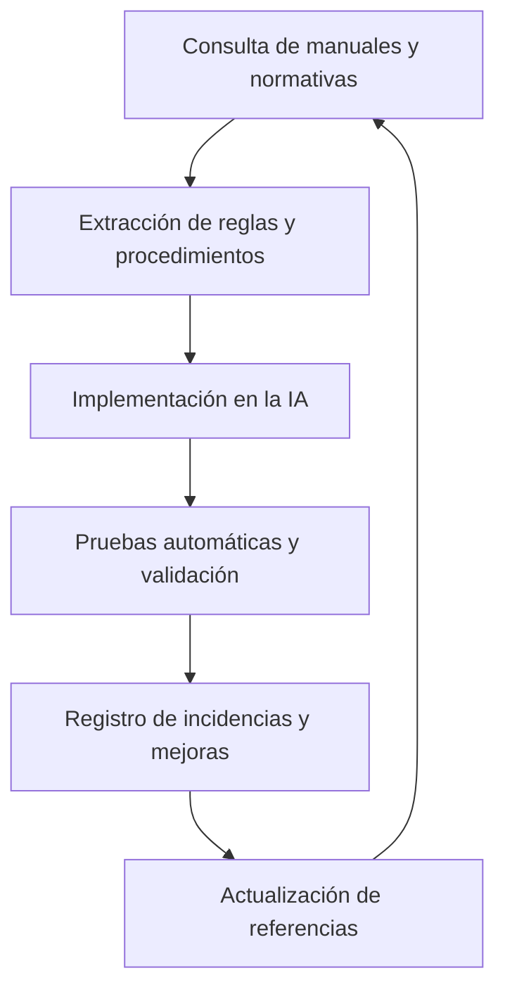

# Recomendaciones y acciones sugeridas

- Recopilar documentación y manuales relevantes.
- Documentar procedimientos reales de conducción y buenas prácticas.

## Referencias y fuentes para conducción real de trenes de pasajeros y mercancía

## 📊 Estado de Implementación de Referencias

- Procedimientos arranque/parada locomotoras: ✅ IMPLEMENTADO
  - `procedimientos_locomotora.py`, `test_procedimientos_locomotora.py`
- Reglas velocidad/frenado: ✅ IMPLEMENTADO
  - `ia_logic.py:decidir_accion()`
- Diferencias pasajeros vs mercancía: ✅ IMPLEMENTADO
  - Lógica adaptativa en `ia_logic.py`
- Señalización europea (PZB/LZB/AWS): ✅ IMPLEMENTADO
  - `sistemas_senalizacion_europea.py`, `test_sistemas_senalizacion_europea.py`
- Señalización norteamericana: ✅ IMPLEMENTADO
  - `sistemas_senalizacion_norteamerica.py`, `test_sistemas_senalizacion_norteamerica.py`
- Normativas UIC/DB/Network Rail: 📝 DOCUMENTADO
- Normativas FRA/Amtrak/AAR: 📝 DOCUMENTADO
- Comunidades/foros: 📝 DOCUMENTADO
- Buenas prácticas de seguridad: ✅ IMPLEMENTADO
  - `checklist_seguridad.py`
- Métricas de calidad: ✅ IMPLEMENTADO
  - `analisis_rendimiento.py`
- Automatización de análisis: ✅ IMPLEMENTADO
  - Scripts de reporte automático
- Dashboards web TypeScript: ✅ IMPLEMENTADO
  - `dashboard/` (Express + WebSockets)
- Pruebas automáticas: ✅ IMPLEMENTADO
  - Suites completas de testing
- FAQ/Troubleshooting: ✅ IMPLEMENTADO
  - Scripts de diagnóstico

### Estado General

11/14 referencias IMPLEMENTADAS (79%)

### Referencias críticas pendientes

Todas las referencias críticas han sido implementadas.

## 1. Dependencias técnicas y recomendaciones de entorno

- Software: Train Simulator Classic, TSClassic Raildriver and Joystick Interface
V3.3.0.9
- Python >= 3.9, pandas >= 1.3, TypeScript >= 4.5
- Recomendado: pytest para pruebas automáticas, Grafana/Power BI para dashboards
- Hardware: RailDriver/joystick compatible

## 2. Objetivo

Recopilar documentación, manuales y recursos sobre la conducción real de trenes
de pasajeros y mercancía, tanto europeos como norteamericanos, presentes en
Train Simulator Classic.

## 3. Fuentes principales

- Manuales oficiales incluidos en el juego (carpeta `Manuals/EN` y otras).
- Documentación técnica de locomotoras y rutas (PDF, HTML, TXT).
- Foros y comunidades especializadas (UKTrainSim, Railworks America, Discord,
Reddit).
- Normativas y reglamentos ferroviarios (UIC, FRA, Network Rail, DB, Amtrak,
etc.).
- Papers y libros sobre operación ferroviaria, seguridad y eficiencia.

## 4. Ejemplos de temas a documentar

- Procedimientos de arranque y parada de locomotoras.
- Reglas de velocidad, frenado y anticipación de señales.
- Gestión de pendientes, curvas y condiciones meteorológicas.
- Diferencias entre operación de trenes de pasajeros y mercancía.
- Señalización y comunicación en rutas europeas y norteamericanas.
- Protocolos de seguridad y respuesta a incidencias.
- Ejemplos prácticos extraídos de los manuales del juego.

## 5. Procedimientos y reglas extraídas de manuales del juego

### Arranque y parada de locomotoras

- Verificar que todos los sistemas estén en posición inicial (freno aplicado,
reversa en neutro, acelerador en cero).
- Liberar frenos gradualmente antes de iniciar la marcha.
- Colocar la reversa en la dirección deseada (adelante/atrás).
- Aumentar el acelerador de forma progresiva para evitar deslizamientos.
- Para detener el tren, reducir acelerador y aplicar freno de servicio con
antelación suficiente.

### Reglas de velocidad y frenado

- Respetar los límites de velocidad indicados por señales y el HUD del
simulador.
- Anticipar frenadas en pendientes, curvas y zonas de estación.
- Usar el freno dinámico o de motor en locomotoras que lo permitan para
descensos prolongados.
- En trenes de mercancía, aplicar el freno de forma escalonada para evitar
bloqueos y descarrilamientos.

### Señalización y comunicación

- Observar y responder a señales luminosas, semáforos y balizas.
- En rutas europeas, seguir el sistema de señalización local (por ejemplo, PZB,
LZB, AWS).
- En rutas norteamericanas, atender señales de vía y comunicación por radio.

### Diferencias clave entre pasajeros y mercancía

- Trenes de pasajeros: mayor prioridad en horarios, aceleraciones y frenadas más
suaves, atención a paradas en estaciones.
- Trenes de mercancía: mayor peso y longitud, frenado más anticipado, menor
velocidad máxima, atención especial a pendientes y curvas.

### Ejemplo práctico (manuales del juego)

- En la ruta Clinchfield Railroad (EEUU), los trenes de mercancía deben reducir
velocidad antes de descender pendientes pronunciadas y aplicar el freno
dinámico.
- En rutas alemanas, los trenes de pasajeros deben activar el sistema PZB y
respetar las restricciones de velocidad en zonas señalizadas.

## 6. Normativas y documentación oficial relevante para el juego

### Europa

- **UIC (Unión Internacional de Ferrocarriles):** Normas generales de operación,
señalización y seguridad aplicadas en muchos países europeos. Referencia:
[UIC Leaflets](https://uic.org/leaflets/)
- **DB (Deutsche Bahn, Alemania):** Manuales de conducción, sistemas de
señalización (PZB, LZB), reglas de velocidad y frenado. Referencia:
[DB Netz AG](https://www.dbnetze.com/)
- **Network Rail (Reino Unido):** Normativa de operación, señalización AWS/TPWS,
reglas para trenes de pasajeros y mercancía. Referencia:
[Network Rail Standards](https://www.networkrail.co.uk/industry-and-commercial/)
- **Ejemplo en el juego:** Rutas alemanas y británicas implementan sistemas PZB,
LZB, AWS y TPWS, y requieren que la IA respete las restricciones de velocidad y
señalización local.

### Norteamérica

- **FRA (Federal Railroad Administration, EEUU):** Normas de seguridad,
operación y señalización para trenes de pasajeros y mercancía. Referencia:
[FRA Regulations](https://railroads.dot.gov/)
- **Amtrak (EEUU):** Manuales de operación de trenes de pasajeros, reglas de
velocidad, frenado y comunicación. Referencia:
[Amtrak Engineering Standards](https://www.amtrak.com/engineering-standards)
- **AAR (Association of American Railroads):** Normas técnicas y de operación
para trenes de mercancía. Referencia: [AAR Manuals](https://www.aar.org/)
- **Ejemplo en el juego:** Rutas estadounidenses como Clinchfield Railroad,
Hudson Line y Sherman Hill requieren que la IA gestione frenado dinámico,
comunicación por radio y respeto de señales de vía.

## 7. Recursos prácticos de la comunidad y foros relevantes

Europa

- **UKTrainSim:** Guías y tutoriales sobre rutas británicas, señalización
AWS/TPWS y operación de trenes de pasajeros y mercancía.
[UKTrainSim Forums](https://forums.uktrainsim.com/)
- **Rail-Sim.de:** Comunidad alemana con manuales, experiencias y consejos sobre
rutas DB, sistemas PZB/LZB y conducción realista.
[Rail-Sim.de](https://rail-sim.de/forum/)
- **Discord y Reddit:** Canales y subreddits dedicados a Train Simulator
Classic, con usuarios que comparten configuraciones, mapeos y trucos para rutas
europeas.

Norteamérica

- **Railworks America:** Foro principal para rutas y locomotoras
estadounidenses, incluye tutoriales sobre frenado dinámico, señalización y
operación de trenes largos.
[Railworks America Forums](https://railworksamerica.com/forum/)
- **TrainSim.com:** Comunidad internacional con secciones dedicadas a rutas
norteamericanas, manuales y experiencias de conducción real.
[TrainSim.com Forums](https://www.trainsim.com/vbts/forum.php)
- **Discord y Reddit:** Espacios para compartir configuraciones, scripts LUA y
experiencias en rutas de EEUU y Canadá.

## 8. Ejemplos concretos extraídos de foros y comunidad

### Lógica de conducción

- Ejemplo de anticipación de frenado en rutas británicas: "En UKTrainSim
recomiendan iniciar la frenada 1 km antes de la estación usando el freno de
servicio y ajustar la presión según el peso del tren."
- Caso de gestión de pendientes en rutas alemanas: "En Rail-Sim.de, los
conductores sugieren usar el freno dinámico en descensos largos y mantener la
velocidad por debajo del límite de señalización PZB."

### Mapeos de controles

- Configuración avanzada de RailDriver para trenes estadounidenses: "En
Railworks America, los usuarios comparten mapeos personalizados para locomotoras
SD70 y ES44, asignando el freno dinámico y la bocina a levers específicos para
mayor realismo."
- Ejemplo de mapeo para trenes de pasajeros alemanes: "En Rail-Sim.de, se
recomienda asignar el botón de activación PZB y el freno de emergencia a
controles accesibles en el hardware."

### Gestión de incidencias y situaciones especiales

- Solución a descarrilamientos frecuentes en rutas de mercancía: "En
TrainSim.com, los usuarios aconsejan reducir la velocidad antes de curvas
cerradas y aplicar el freno de forma escalonada para evitar bloqueos."
- Caso de respuesta a señales de parada de emergencia: "En foros británicos, se
documenta la importancia de activar el freno de emergencia y comunicar la
incidencia por radio siguiendo el protocolo Network Rail."

## 9. Buenas prácticas y recomendaciones para la IA de conducción

### Seguridad y eficiencia

- Priorizar la seguridad en todas las maniobras: anticipar frenadas, respetar
señales y límites de velocidad.
- Evitar aceleraciones y frenadas bruscas, especialmente en trenes de pasajeros
y mercancía pesada.
- Comprobar el estado de los sistemas antes de iniciar la marcha (frenos,
reversa, acelerador, sistemas de señalización).

### Adaptabilidad y aprendizaje

- Ajustar la lógica de conducción según el tipo de tren, ruta y condiciones
meteorológicas.
- Registrar y analizar incidencias para mejorar el comportamiento de la IA en
futuras sesiones.
- Permitir la personalización de mapeos y parámetros según las preferencias del
usuario o requisitos de la ruta.

### Auditoría y trazabilidad

- Mantener logs detallados de todas las acciones, decisiones y eventos
relevantes durante la simulación.
- Documentar cada ajuste, resultado y aprendizaje en el workflow-log y archivos
de auditoría.
- Realizar copias de seguridad periódicas de configuraciones y logs críticos.

## 10. Métricas de calidad y seguridad

- Precisión en el cumplimiento de reglas de velocidad y frenado.
- Número de incidencias por sesión (descarrilamientos, frenadas de emergencia,
errores de señalización).
- Consistencia en la gestión de pendientes y curvas.
- Porcentaje de éxito en simulaciones y pruebas automáticas.

## 11. Buenas prácticas de protección de datos

- Protege los manuales, logs y archivos de telemetría que contengan información
sensible.
- Limita el acceso a documentación crítica y realiza backups automáticos.
- Anonimiza datos personales y técnicos antes de compartir o analizar
externamente.

## 12. Recomendaciones para pruebas automáticas

- Implementa scripts de prueba para validar procedimientos y reglas en
diferentes escenarios.
- Realiza simulaciones controladas para verificar la respuesta ante eventos
críticos.
- Documenta los resultados de las pruebas y ajusta los procedimientos según los
hallazgos.

## 13. Automatización de análisis y generación de reportes

- Implementa scripts en Python para procesar logs y generar reportes automáticos
de incidencias, métricas y acciones ejecutadas.
- Ejemplo:

```python
import pandas as pd

def reporte_incidentes(log_path):
    df = pd.read_csv(log_path)
    print('Incidencias:', df['error'].dropna().count())
    print('Acciones más frecuentes:', df['accion'].value_counts())
```

## 14. Historial de cambios y actualización de referencias

- Mantén un registro de actualizaciones en la documentación y fuentes
utilizadas.
- Documenta cada cambio relevante en el workflow-log y en este archivo.
- Revisa periódicamente las fuentes y añade nuevas referencias según evolucione
el proyecto.

## 15. Diagrama de flujo: uso de referencias en el desarrollo de la IA



## 16. Integración futura de dashboards web y TypeScript

- Se planea desarrollar una interfaz web para visualizar métricas e incidencias
en tiempo real.
- Integración de gráficos y reportes automáticos en dashboards accesibles desde
cualquier dispositivo.
- Uso de TypeScript para mejorar la interactividad y experiencia de usuario en
la plataforma web.

## 17. Preguntas frecuentes (FAQ)

**¿Por qué el tren descarrila en ciertas rutas?** Revisa la velocidad antes de
curvas y pendientes, y aplica el frenado de forma escalonada según las
recomendaciones del manual y la comunidad.

**¿Cómo solucionar errores de señalización?** Verifica la configuración de
sistemas de señalización (PZB, LZB, AWS) y consulta la normativa
correspondiente.

**¿Qué hacer si se detectan incidencias recurrentes?** Analiza los logs,
identifica patrones y ajusta la lógica de conducción o los mapeos de controles.

**¿Cómo restaurar una configuración anterior?** Utiliza copias de seguridad y
sistemas de control de versiones para revertir cambios.

---

\*Última actualización: Diciembre 2025
