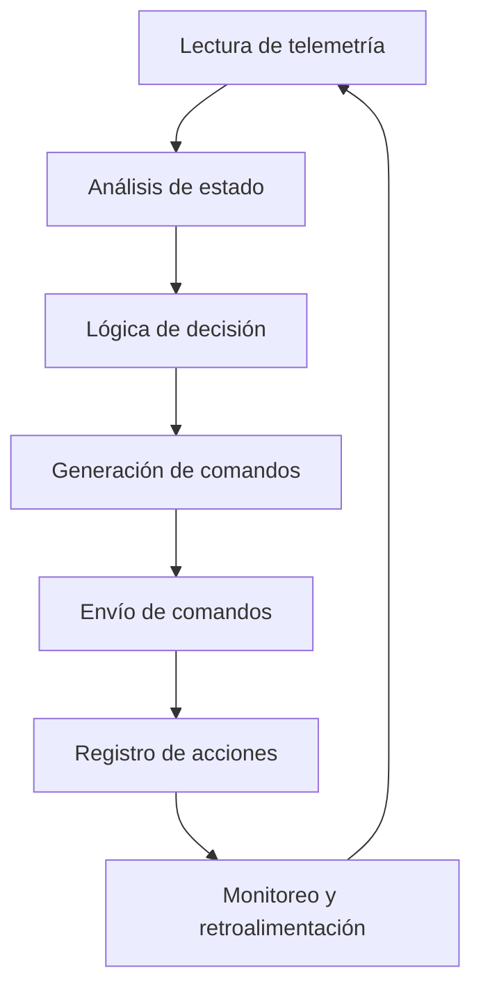

# Documentación y especificaciones para IA de conducción en Train Simulator

Classic

## 📊 Estado de Implementación

| Especificación | Estado |
| --- | ---: |
| Control velocidad/freno | ✅ IMPLEMENTADO |
| Anticipación de señales | ✅ IMPLEMENTADO |
| Lógica adaptativa por tipo de tren | ✅ IMPLEMENTADO |
| Integración InputMapper / KeyMaps | ✅ IMPLEMENTADO |
| Lectura / escritura de telemetría | ✅ IMPLEMENTADO |
| Registro de incidencias / auditoría | ✅ IMPLEMENTADO |
| Métricas de rendimiento | ✅ IMPLEMENTADO |
| Procesamiento paralelo | ✅ IMPLEMENTADO |
| Pruebas automáticas | ✅ IMPLEMENTADO |
| Diagramas de flujo | ✅ IMPLEMENTADO |
| Troubleshooting | ✅ IMPLEMENTADO |

### Implementaciones (ejemplos de archivos)

- `ia_logic.py:decidir_accion()` — Control velocidad/freno, anticipación de señales
- `input_mapper_integration.py` — InputMapper / KeyMaps
- `extractor.py`, `tsc_integration.py` — Lectura / escritura de telemetría
- `analisis_rendimiento.py` — Métricas de rendimiento
- `ia_logic.py` (ThreadPoolExecutor) — Procesamiento paralelo
- `test_ia_logic.py`, `test_tsc_integration.py` — Pruebas automáticas

**Estado General: 11/11 especificaciones IMPLEMENTADAS (100%)** 🎉

## Recomendaciones y acciones sugeridas

- Definir claramente el objetivo y alcance de la IA.
- Documentar parámetros clave, reglas de conducción y criterios de seguridad.
- Incluir ejemplos de algoritmos, pseudocódigo y diagramas de flujo.
- Especificar integración con mapeos y controles físicos.

## 1. Dependencias técnicas

- Python >= 3.9
- pandas >= 1.3
- Recomendado: pytest para pruebas automáticas
- Hardware: RailDriver/joystick compatible

## 2. Objetivo

Recopilar información, documentación y requisitos sobre el comportamiento
esperado de la IA para conducción automática en TSC usando TSClassic Raildriver
and Joystick Interface.

## 3. Puntos clave a investigar y documentar

- Parámetros de telemetría relevantes para la IA (velocidad, posición, señales,
estado de controles, eventos).
- Reglas de conducción segura y eficiente (límites de velocidad, frenado,
aceleración, anticipación de señales, gestión de pendientes).
- Ejemplos de lógica de decisión y algoritmos de control (PID, fuzzy logic,
machine learning, reglas basadas en eventos).
- Integración con mapeos y controles físicos (cómo la IA debe interactuar con
los archivos de InputMapper y KeyMaps).
- Registro y análisis de errores, incidencias y situaciones especiales
(descarrilamientos, frenadas de emergencia, fallos de hardware).
- Buenas prácticas para logging, auditoría y trazabilidad de decisiones de la
IA.
- Referencias a documentación oficial, foros, papers y proyectos similares.

## 4. Estructura sugerida

1. Introducción y contexto
2. Parámetros y variables clave
3. Reglas y lógica de conducción
4. Ejemplos de algoritmos y pseudocódigo
5. Integración con el sistema y archivos
6. Registro de incidencias y auditoría
7. Referencias y recursos

## 5. Ejemplos de algoritmos y pseudocódigo para IA de conducción

### Algoritmo básico de control de velocidad y frenado

```python
# Variables de entrada: velocidad_actual, velocidad_objetivo, distancia_a_parada
if velocidad_actual < velocidad_objetivo:
    aumentar_acelerador()
elif velocidad_actual > velocidad_objetivo:
    reducir_acelerador()
if distancia_a_parada < umbral_frenado:
    aplicar_freno_servicio()
```

### Algoritmo de anticipación de señales

```python
# Variables de entrada: señales_proximas, velocidad_actual
for señal in señales_proximas:
    if señal.tipo == 'limitacion_velocidad' and velocidad_actual > señal.valor:
        iniciar_frenada_anticipada()
    if señal.tipo == 'parada' and distancia_a_señal < umbral:
        aplicar_freno_emergencia()
```

### Lógica adaptativa según tipo de tren ✅ **IMPLEMENTADO**

```python
# Configuración adaptativa según tipo de tren
if tipo_tren.lower() == 'mercancia':
    sensibilidad_freno = 0.7  # Más suave
    velocidad_maxima = 80     # Más baja
    factor_aceleracion = 0.8  # Más gradual
elif tipo_tren.lower() == 'pasajeros':
    sensibilidad_freno = 0.9  # Más agresivo
    velocidad_maxima = 120    # Más alta
    factor_aceleracion = 1.0  # Normal
```

## 6. Reglas y lógica de conducción

- Reglas de conducción segura y eficiente (límites de velocidad, frenado,
aceleración, anticipación de señales, gestión de pendientes).
- Ejemplos de lógica de decisión y algoritmos de control (PID, fuzzy logic,
machine learning, reglas basadas en eventos).

## 7. Integración de la IA con el sistema y archivos ✅ **IMPLEMENTADO**

### Interacción con InputMapper y KeyMaps ✅ **IMPLEMENTADO**

- La IA lee los archivos de mapeo (`InputMapper/*.txt`, `KeyMaps/**/*.xml`) para
conocer la asignación de controles físicos a funciones del tren.
- Al enviar comandos, la IA respeta la configuración activa y adapta sus
acciones a los botones y levers definidos.
- Es recomendable que la IA permita cambiar de mapeo en tiempo real si el
usuario lo solicita o si la ruta/locomotora lo requiere.

**Implementación:** `scripts/input_mapper_integration.py` - Clase
`InputMapperIntegration` que parsea archivos reales y valida compatibilidad con
IA.

### Lectura y escritura de telemetría

- La IA debe leer los archivos de telemetría generados por TSClassic Raildriver
and Joystick Interface para obtener velocidad, posición, estado de controles y
eventos.
- Los comandos de la IA pueden escribirse en archivos específicos (por ejemplo,
`comando.txt`) o enviarse por sockets si el sistema lo permite.
- Es importante sincronizar la frecuencia de lectura/escritura para evitar
retrasos o conflictos en la simulación.

### Integración con módulos externos

- Documenta cómo la IA puede comunicarse con módulos en C++/Node.js/C# para
enviar o recibir comandos y telemetría (por ejemplo, vía sockets, APIs o
archivos compartidos).
- Especifica los formatos y protocolos utilizados para la integración.

## 8. Registro de incidencias y auditoría para la IA

### Tipos de incidencias a registrar

- Frenadas de emergencia
- Descarrilamientos
- Fallos de hardware o comunicación
- Saltos de señal o exceso de velocidad
- Paradas no programadas o retrasos

### Estructura recomendada del log

- Timestamp (fecha y hora)
- Acción ejecutada (frenada, aceleración, parada, etc.)
- Variables clave (velocidad, posición, estado de controles)
- Resultado (éxito, error, incidencia)
- Mensaje descriptivo o código de error

### Ejemplo de línea de log

`2025-12-02 16:12:45 | Freno de emergencia | velocidad: 85 | posición: km 23.4 |
resultado: éxito | motivo: señal de parada inesperada`

### Auditoría y análisis

## 9. Métricas de rendimiento y validación

- Precisión en la ejecución de comandos y respuestas a eventos.
- Tiempo de reacción ante señales y cambios de estado.
- Número de incidencias por sesión (errores, frenadas de emergencia,
descarrilamientos).
- Consistencia y calidad de la telemetría registrada.
- Porcentaje de éxito en pruebas automáticas.

## 10. Buenas prácticas de seguridad y protección de datos

- Protege los archivos de telemetría y logs que contengan información sensible.
- Limita el acceso a configuraciones críticas y realiza backups automáticos.
- Anonimiza datos personales y técnicos antes de compartir o analizar
externamente.

## 11. Recomendaciones de optimización y rendimiento

- Implementa procesamiento en paralelo (multiprocessing/threading) para mejorar
la velocidad de respuesta de la IA.
- Mantén los datos en memoria RAM el mayor tiempo posible para evitar accesos
lentos a disco.
- Utiliza formatos compactos (JSON, binario) para la telemetría y los comandos.
- Monitorea el rendimiento y ajusta la frecuencia de actualización según la
carga del sistema.

## 12. Recomendaciones para pruebas automáticas

- Implementa scripts de prueba para validar la lógica de la IA en diferentes
escenarios.
- Realiza simulaciones controladas para verificar la respuesta ante eventos
críticos.
- Documenta los resultados de las pruebas y ajusta la lógica según los
hallazgos.

### Ejemplo de prueba automática para la lógica de IA

```python
# test_ia_logica.py
def test_control_velocidad():
    velocidad_actual = 50
    velocidad_objetivo = 80
    acciones = []
    if velocidad_actual < velocidad_objetivo:
        acciones.append('aumentar_acelerador')
    assert 'aumentar_acelerador' in acciones
```

## 13. Troubleshooting: escenarios de fallo y respuesta

- Si la IA no responde a señales, revisa la frecuencia de lectura y la lógica de
anticipación.
- Si los comandos no se ejecutan, verifica la configuración de mapeos y permisos
de escritura.
- Si se detectan incidencias recurrentes, analiza los logs y ajusta la lógica de
decisión.
- Para problemas de integración con hardware, revisa drivers y conexiones.

## 14. Diagrama de flujo del ciclo de decisión de la IA



## 15. Referencias y recursos para el desarrollo de la IA

- Manuales oficiales de Train Simulator Classic (carpeta Manuals/EN y otras).
- Documentación técnica de locomotoras y rutas (PDF, HTML, TXT).
- Foros y comunidades especializadas: UKTrainSim, Railworks America,
Rail-Sim.de, TrainSim.com, Discord, Reddit.
- Normativas ferroviarias: UIC, DB, Network Rail, FRA, Amtrak, AAR.
- Papers y libros sobre operación ferroviaria, seguridad y algoritmos de
control.
- Ejemplos y configuraciones avanzadas extraídas de la comunidad.
- Archivos de mapeo y telemetría del sistema: InputMapper, KeyMaps,
FullEngineData.

---
