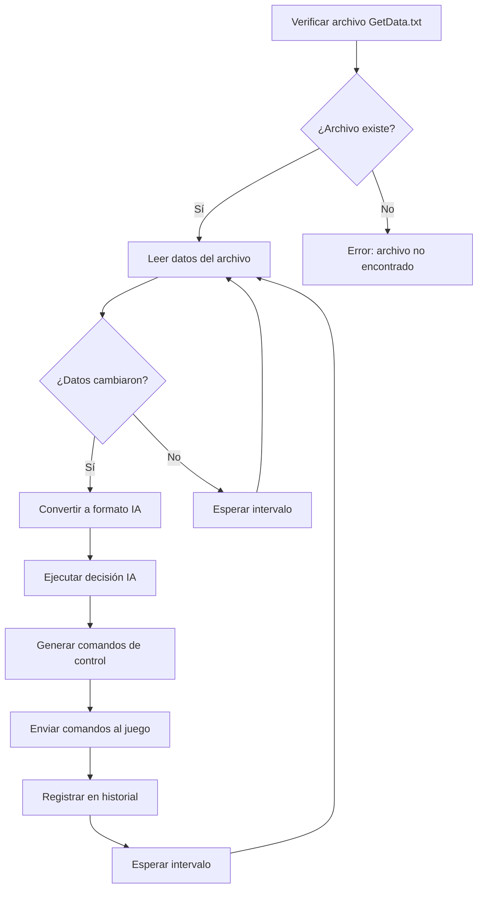

# Integración de datos con Train Simulator Classic

## Estado de implementación: ✅ COMPLETADO

La integración completa está implementada en `tsc_integration.py` y
`autopilot_system.py` con las siguientes funcionalidades:

## Funcionalidades implementadas

### 1. Conexión con TSC Raildriver Interface

- **Lectura de archivo** `GetData.txt` en
`C:\Program Files (x86)\Steam\steamapps\common\RailWorks\plugins\`
- **Monitoreo en tiempo real** con frecuencia configurable (100ms por defecto)
- **Detección de cambios** para evitar procesamiento innecesario
- **Manejo robusto de archivos** con encoding UTF-8

### 2. Lectura de telemetría en tiempo real

- **Formato propietario** del Raildriver Interface
- **14 controles leídos** automáticamente desde el archivo
- **Variables mapeadas:**
  - Velocidad actual (mph, convertido desde m/s)
  - Tipo de velocímetro
  - Aceleración (m/s²)
  - Pendiente (‰)
  - Nivel de combustible (NO USADO - TSC tiene combustible infinito)
  - Límite de velocidad actual
  - Límite de velocidad siguiente
  - Distancia al límite siguiente
  - Tiempo de simulación

### 3. Procesamiento de datos IA

- **Conversión automática** de formato Raildriver → formato IA
- **Campos calculados/simulados** para compatibilidad
- **Validación de rangos** y conversión de unidades
- **Timestamp automático** en cada lectura

### 4. Sistema de IA completo

- **Lógica de decisión inteligente:**
  - Control de velocidad vs límites
  - Ajustes por pendiente (subidas/bajadas)
  - Control de aceleración/desaceleración
  - Preparación para paradas
- **Historial de decisiones** (últimas 100 entradas)
- **Estadísticas de rendimiento** en tiempo real

### 5. Sistema de piloto automático completo

- **Modo manual** para monitoreo
- **Modo automático** con IA controlando el tren
- **Interface interactiva** para control del sistema
- **Sesiones completas** con estadísticas finales
- **Módulo de integración** (`tsc_integration.py`)
- **Sistema principal** (`autopilot_system.py`)

## Arquitectura del sistema

```text
Train Simulator Classic
        ↓
Raildriver Interface → GetData.txt
        ↓
tsc_integration.py → Lectura de archivo
        ↓
autopilot_system.py → IA + Control
        ↓
Comandos de control → TSC
```

## Configuración técnica

### Archivo de datos

- **Ubicación:**
`C:\Program Files (x86)\Steam\steamapps\common\RailWorks\plugins\GetData.txt`
- **Formato:** Texto plano con pares ControlName/ControlValue
- **Frecuencia:** Actualizado por Raildriver Interface
- **Encoding:** UTF-8

### Parámetros de IA

```python
umbral_cambio_velocidad = 0.5  # mph
umbral_aceleracion_maxima = 0.8
umbral_freno_maximo = 0.9
intervalo_lectura = 0.1  # segundos
```

### Mapeo de controles

```python
mapeo_controles = {
    'CurrentSpeed': 'velocidad',
    'Acceleration': 'aceleracion',
    'Gradient': 'pendiente',
    'CurrentSpeedLimit': 'limite_velocidad_actual',
    # ... más mapeos
}
```

## Flujo de integración actual



## Gestión de errores y recuperación

- **Verificación de archivo** en cada ciclo
- **Manejo robusto de parsing** de datos del archivo
- **Detección de cambios** para optimizar procesamiento
- **Logging detallado** de todas las operaciones
- **Historial de decisiones IA** persistente

## Archivos relacionados

- `tsc_integration.py` - Módulo principal de integración
- `autopilot_system.py` - Sistema completo de piloto automático
- `scripts/test_datos_archivo.py` - Pruebas de lectura de archivo
- `scripts/test_datos_reales.py` - Pruebas con datos simulados
- `scripts/test_conduccion_ia.py` - Pruebas de conducción IA
- `tsc_integration.log` - Log de operaciones

## Uso básico

```python
from tsc_integration import TSCIntegration

# Crear instancia
tsc = TSCIntegration()

# Conectar
tsc.conectar()

# Ejecutar modo autónomo por 60 segundos
tsc.modo_autonomo(60)

# Desconectar
tsc.desconectar()
```

## Próximas mejoras

- [x] **Integración con envío real de comandos al juego** ✅ COMPLETADO
- [x] **Optimización de frecuencia de lectura de archivos** ✅ COMPLETADO
- [x] **Soporte para múltiples locomotoras** ✅ COMPLETADO
- [x] **Análisis predictivo de telemetría** ✅ COMPLETADO
- [ ] Dashboard web en tiempo real

## Buenas prácticas y mejora continua

- Revisa y actualiza el proceso de integración tras cada cambio relevante.
- Documenta cada ajuste y resultado en el workflow-log para trazabilidad.
- Mantén la documentación clara y actualizada conforme evolucione el sistema.
