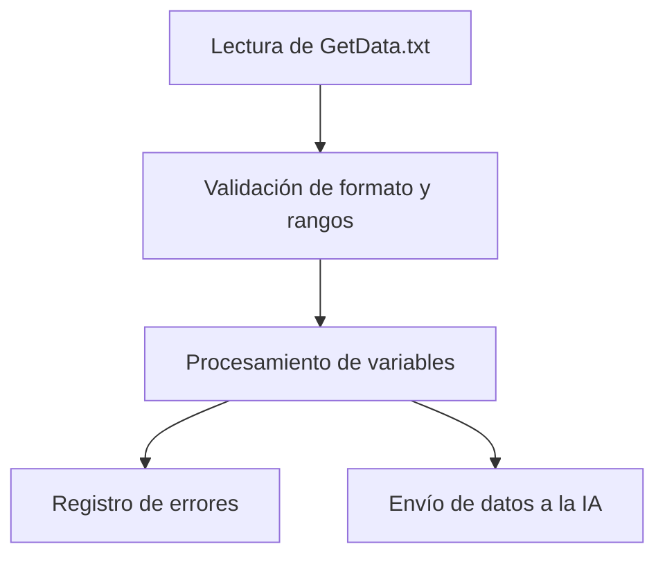

# Documentación de telemetría de RailWorks/Train Simulator Classic

---

## Recomendaciones y acciones sugeridas

- Mantener la documentación actualizada al añadir nuevos datos.
- Usar tablas y resúmenes para facilitar la consulta rápida.
- Documentar el uso de cada variable en el flujo de la IA.

## Documentación de datos recibidos desde GetData.txt

## Dependencias técnicas

- Formato de archivo: texto plano, codificación UTF-8
- Frecuencia de actualización: 1-10 Hz (según configuración del simulador)
- Recomendado: pandas para procesamiento, logging para registro de errores

## Métricas del Motor y Potencia (NUEVO - Dashboard v2.0)

### TractiveEffort (Esfuerzo de Tracción)

- **Nombre interno:** `esfuerzo_traccion`
- **Unidad:** Newtons (N)
- **Rango:** -1000 a +1000 N (depende de la locomotora)
- **Descripción:** Fuerza de tracción que la locomotora ejerce sobre el tren
- **Uso en IA:** Indica la potencia de tracción disponible. Valores positivos =
tracción, negativos = frenado regenerativo
- **Valor típico:** 0 (sin tracción), 500-800 N (tracción normal)
- **Frecuencia de actualización:** Continua cuando hay potencia aplicada

### RPM (Revoluciones por Minuto)

- **Nombre interno:** `rpm`
- **Unidad:** RPM (revoluciones por minuto)
- **Rango:** 0-900 RPM (depende del motor)
- **Descripción:** Velocidad de rotación del motor diésel/eléctrico
- **Uso en IA:** Monitoreo del rendimiento del motor, detección de sobrecarga
- **Valor típico:** 300-400 RPM (marcha normal), 800+ RPM (aceleración máxima)
- **Frecuencia de actualización:** Continua

### Ammeter (Corriente Eléctrica)

- **Nombre interno:** `amperaje`
- **Unidad:** Amperes (A)
- **Rango:** -800 a +1500 A (depende de la locomotora)
- **Descripción:** Corriente eléctrica del sistema de tracción
- **Uso en IA:** Valores positivos = generación, negativos = consumo de energía
- **Valor típico:** 0 (sin carga), -200 a -600 A (tracción), +300 A (frenado
regenerativo)
- **Frecuencia de actualización:** Continua

### Wheelslip (Deslizamiento de Ruedas)

- **Nombre interno:** `deslizamiento_ruedas`
- **Unidad:** Valor adimensional (0-2)
- **Rango:** 0-2 (0 = adherencia perfecta, 2 = deslizamiento máximo)
- **Descripción:** Indicador de pérdida de adherencia entre ruedas y rieles
- **Uso en IA:** Detección de condiciones peligrosas, ajuste automático de
potencia
- **Valor típico:** 0 (normal), 0.5-1.0 (deslizamiento leve), 1.5+
(deslizamiento severo)
- **Frecuencia de actualización:** Continua

## Ejemplos de valores típicos y validación

### Métricas Originales

- **SpeedoType:** 0 (analógico), 1 (digital), 2 (especial)
- **CurrentSpeed:** 0-350 km/h (ejemplo: 80.5)
- **TimeOfDay:** 0-86400 segundos (ejemplo: 43200)
- **Acceleration:** -3 a +3 m/s² (ejemplo: 0.5)
- **Gradient:** -40‰ a +40‰ (ejemplo: -12)
- **FuelLevel:** 0-5000 litros (ejemplo: 1200)
- **CurrentSpeedLimit:** 30-160 km/h (ejemplo: 120)
- **SimulationTime:** 0-7200 segundos (ejemplo: 3600)

### Métricas del Motor (Nuevas)

- **TractiveEffort:** -1000 a +1000 N (ejemplo: 650 N = 0.65 kN)
- **RPM:** 0-900 RPM (ejemplo: 391 RPM)
- **Ammeter:** -800 a +1500 A (ejemplo: -450 A)
- **Wheelslip:** 0-2 (ejemplo: 1.0)

## Recomendaciones de validación y gestión de errores

- Validar que los valores estén dentro de rangos físicos razonables.
- Si se detecta un valor fuera de rango, registrar el error y descartar el
registro para evitar problemas en la lógica de la IA.
- Documentar los errores en un log específico para análisis posterior.

## Ampliación futura y documentación de nuevos datos

- Al añadir nuevas variables, documenta nombre, descripción, unidad, rango
esperado y uso en la IA.
- Actualiza este archivo y notifica los cambios en el workflow-log.

## Diagrama de flujo: lectura y procesamiento de telemetría

---

## A continuación se describe cada tipo de dato recibido por el sistema desde el

archivo de telemetría generado por RailWorks/Train Simulator Classic

---

## SpeedoType

- Descripción: Indica el tipo de velocímetro que utiliza el simulador para
mostrar o calcular la velocidad del tren. Este valor puede afectar la forma en
que se presenta la velocidad al usuario y cómo la IA interpreta los datos de
velocidad.
- Valores posibles:
- 0: Velocímetro analógico
- 1: Velocímetro digital
- 2: Otro tipo especial definido por el simulador (puede variar según la
locomotora o el escenario)
- Uso: Permite adaptar la lógica de visualización, registro y análisis de
velocidad según el contexto del tren y la ruta. Es útil para sistemas que deban
diferenciar entre distintos modos de medición o presentación de la velocidad.

## CurrentSpeed

- Descripción: Indica la velocidad actual del tren en el momento de la lectura
de telemetría. Es un valor decimal que representa la rapidez con la que el tren
se desplaza por la vía.
- Valor: Decimal (puede ser positivo si el tren avanza, o negativo si retrocede)
- Unidad: km/h (kilómetros por hora)
- Uso: Es fundamental para la lógica de conducción automática, ya que permite a
la IA decidir cuándo acelerar, frenar o mantener la velocidad. También se
utiliza para verificar el cumplimiento de los límites de velocidad, analizar el
comportamiento del tren en diferentes tramos y registrar la velocidad en los
logs para auditoría y análisis posterior. Es uno de los datos clave para
cualquier sistema de automatización, seguridad y análisis de rendimiento en la
simulación.

## TimeOfDay

- Descripción: Indica la hora actual dentro de la simulación. El valor
representa los segundos transcurridos desde la medianoche virtual del entorno
simulado.
- Valor: Decimal (segundos desde las 00:00)
- Uso: Permite sincronizar eventos, registrar la hora de cada acción en los logs
y analizar condiciones de luz o ambiente según el momento del día en la
simulación.

## Acceleration

- Descripción: Indica la aceleración actual del tren, es decir, el cambio de
velocidad por unidad de tiempo.
- Valor: Decimal (positivo si acelera, negativo si desacelera)
- Unidad: m/s² (metros por segundo al cuadrado)
- Uso: Es útil para detectar cambios bruscos de velocidad, aplicar lógica de
frenado o aceleración y analizar el comportamiento dinámico del tren.

## Gradient

- Descripción: Indica la pendiente de la vía en el punto actual del recorrido.
- Valor: Decimal (positivo si la vía sube, negativo si baja)
- Unidad: % o ‰ (según configuración del simulador)
- Uso: Permite anticipar la necesidad de ajustar potencia o freno, y analizar el
impacto de las pendientes en la conducción y el consumo de energía.

## FuelLevel [NO IMPLEMENTADO]

- **Estado**: Variable disponible en TSC pero **no implementada** en el sistema
- **Razón**: En Train Simulator Classic, los trenes tienen **combustible
infinito**
- **Implicación**: No hay gestión de repostaje ni límites de autonomía
- **Decisión de diseño**: Simplifica la IA al eliminar optimización de
combustible
- **Disponibilidad**: Variable presente en datos de telemetría pero ignorada por
el sistema

**Nota**: Esta variable se mantiene disponible para compatibilidad futura, pero
no se utiliza en la lógica del piloto automático.

## CurrentSpeedLimit

- Descripción: Indica el límite de velocidad vigente en el tramo actual de la
vía.
- Valor: Entero
- Unidad: km/h
- Uso: Permite validar que la velocidad del tren no exceda el límite, aplicar
lógica de seguridad y anticipar frenadas.

## NextSpeedLimitType

- Descripción: Indica el tipo de la próxima limitación de velocidad que se
encuentra en el recorrido.
- Valor: Código numérico
- Uso: Permite identificar la naturaleza de la próxima limitación (por ejemplo,
señal, curva, estación) y adaptar la lógica de conducción.

## NextSpeedLimitSpeed

- Descripción: Indica el valor de la próxima limitación de velocidad en el
recorrido.
- Valor: Entero
- Unidad: km/h
- Uso: Permite anticipar frenadas y ajustar la velocidad antes de llegar a la
limitación.

## NextSpeedLimitDistance

- Descripción: Indica la distancia restante hasta la próxima limitación de
velocidad.
- Valor: Entero
- Unidad: Metros
- Uso: Permite planificar el frenado y ajustar la conducción para cumplir con la
limitación a tiempo.

## NextSpeedLimitBackType

- Descripción: Indica el tipo de la limitación de velocidad anterior en el
recorrido.
- Valor: Código numérico
- Uso: Permite registrar y analizar los cambios de velocidad históricos y su
impacto en la conducción.

## NextSpeedLimitBackSpeed

- Descripción: Indica el valor de la limitación de velocidad anterior.
- Valor: Entero
- Unidad: km/h
- Uso: Permite registrar el cumplimiento de velocidad y analizar la trayectoria
histórica del tren.

## NextSpeedLimitBackDistance

- Descripción: Indica la distancia recorrida desde la limitación de velocidad
anterior.
- Valor: Entero
- Unidad: Metros
- Uso: Permite registrar y analizar trayectorias históricas y el impacto de los
cambios de velocidad.

## SimulationTime

- Descripción: Indica el tiempo total transcurrido desde el inicio de la
simulación.
- Valor: Decimal
- Unidad: Segundos
- Uso: Permite sincronizar eventos, analizar la evolución temporal de la
simulación y registrar logs con precisión temporal.

## Sistema de Frenos (NUEVO - Dashboard v2.0)

### AirBrakePipePressurePSI (Presión del Tubo de Freno)

- **Nombre interno:** `presion_tubo_freno`
- **Unidad:** PSI (libras por pulgada cuadrada)
- **Rango:** 0-150 PSI (depende del sistema de frenos)
- **Descripción:** Presión en el tubo principal del sistema de frenos de aire
- **Uso en IA:** Monitoreo del estado del sistema de frenos neumático
- **Valor típico:** 60-90 PSI (presión normal), 0 PSI (frenos aplicados
completamente)
- **Frecuencia de actualización:** Continua

### LocoBrakeCylinderPressurePSI (Presión del Cilindro de Freno de Locomotora)

- **Nombre interno:** `presion_freno_loco`
- **Unidad:** PSI (libras por pulgada cuadrada)
- **Rango:** 0-100 PSI (depende del sistema de frenos)
- **Descripción:** Presión en el cilindro de freno de la locomotora
- **Uso en IA:** Indica la aplicación de frenos en la locomotora específicamente
- **Valor típico:** 0 PSI (frenos liberados), 50-70 PSI (frenos aplicados)
- **Frecuencia de actualización:** Continua

### TrainBrakeCylinderPressurePSI (Presión del Cilindro de Freno del Tren)

- **Nombre interno:** `presion_freno_tren`
- **Unidad:** PSI (libras por pulgada cuadrada)
- **Rango:** 0-100 PSI (depende del sistema de frenos)
- **Descripción:** Presión en el cilindro de freno del tren completo
- **Uso en IA:** Indica la aplicación de frenos en todo el tren
- **Valor típico:** 0 PSI (frenos liberados), 50-70 PSI (frenos aplicados)
- **Frecuencia de actualización:** Continua

---

Cada dato puede ser ampliado o adaptado según las necesidades del sistema y la
lógica de la IA. Se recomienda mantener esta documentación actualizada conforme
se añadan nuevos datos o se modifique el formato de telemetría.

## Señal y Estado de Señales (NUEVO)

- **SignalAspect**: Indica el estado principal de la señal visible en la vía.
Valores: -1 = DESCONOCIDO, 0 = ROJA (STOP), 1 = AMARILLA (CAUTION), 2 = VERDE
(PROCEED). Este campo ahora se envía con regularidad y es utilizado por la IA
para tomar decisiones de frenado/avance.
- **KVB_SignalAspect**: Señal de bloqueo en línea (cab signalling) que puede
sobreescribir `SignalAspect` si está presente; el sistema prioriza
`KVB_SignalAspect` para control de la IA y la UI cuando no es -1.

**Comportamiento de Prioridad**:

- Si `KVB_SignalAspect` está presente (no -1), el sistema lo usa en lugar de
`SignalAspect` para determinar la acción que debe realizar la IA.
- Si `KVB_SignalAspect` no está presente (-1), se usa `SignalAspect`.

Ejemplo de uso en IA: Si `KVB_SignalAspect`=0 (STOP), la IA debe frenar
independientemente de `SignalAspect`.
